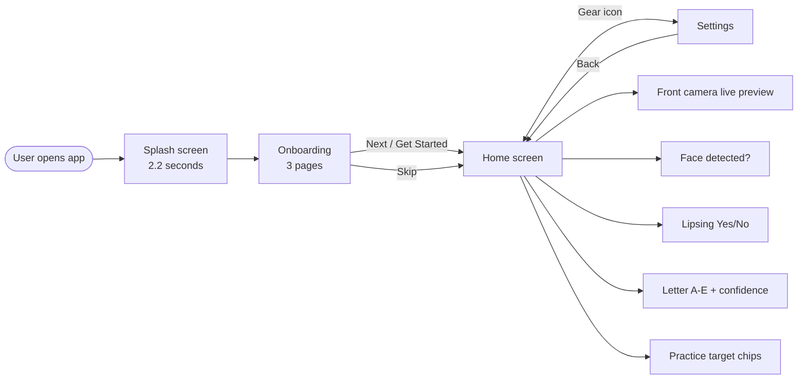
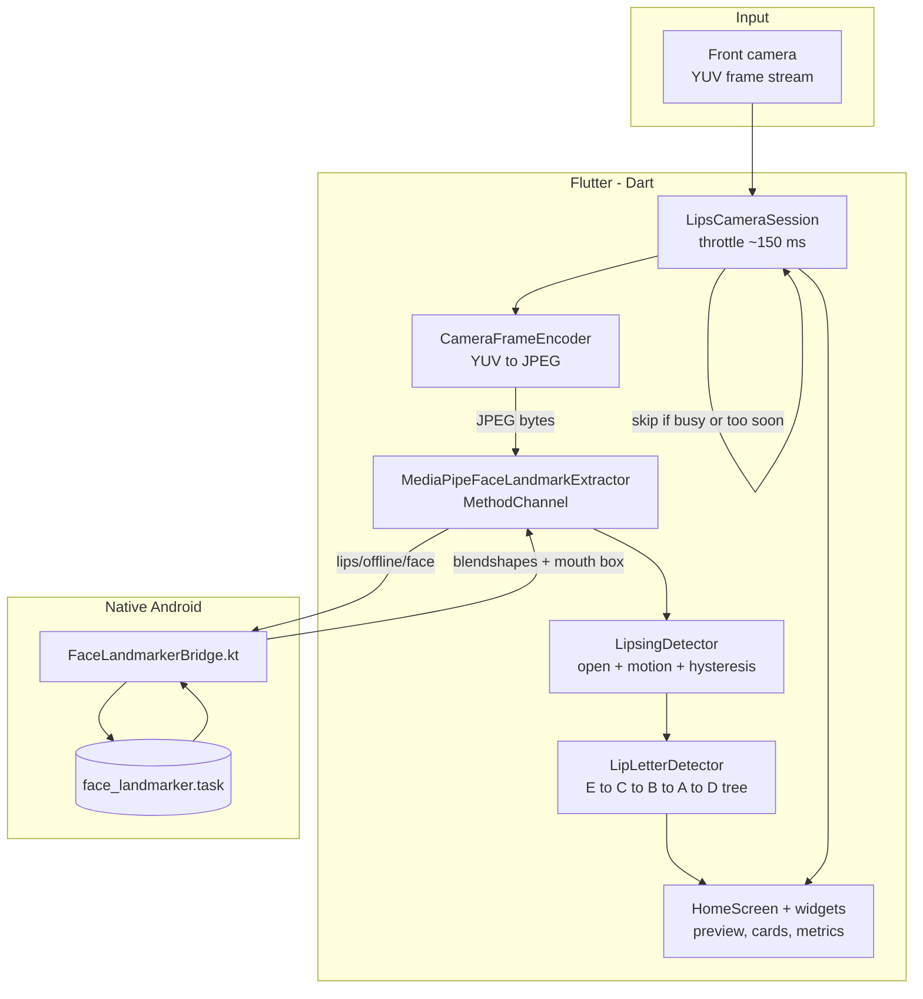
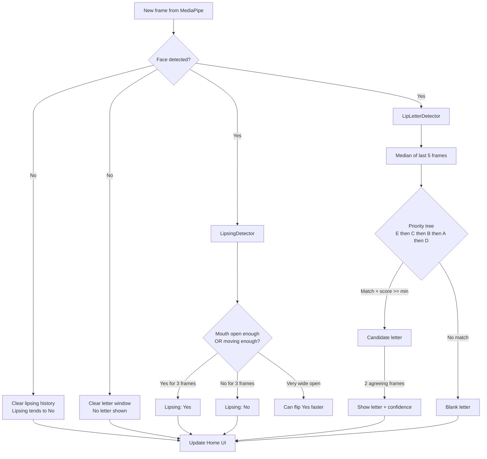
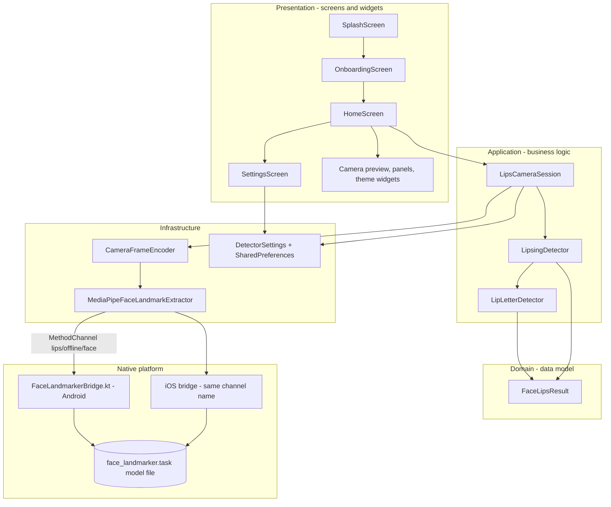

# Lips Offline — Graduation Project

**GitHub:** [minarehan700-eng/GP-Lips-Detection](https://github.com/minarehan700-eng/GP-Lips-Detection)

A Flutter mobile app I built for my graduation project. It uses your phone’s **front camera** to watch your mouth in real time — **fully offline**, with no internet and no cloud server.

The app answers two simple questions:

1. **Are you lipsing?** (moving your mouth as if speaking, but without voice — common in sign language)
2. **Which mouth shape (viseme letter A–E) best matches what you are doing right now?**

> **Viseme** = a mouth shape linked to a speech sound (not a whole word).  
> **Lipsing** = mouthing words silently while signing.

This project is a **standalone** app. It only reuses MediaPipe’s face pipeline — it does **not** include hand signs, dictionaries, login, or other features from the separate Signly project.

For a full university-style report with more diagrams and testing notes, see [`docs/LIPS_OFFLINE_DISSERTATION.md`](docs/LIPS_OFFLINE_DISSERTATION.md).

---

## About

Many sign languages use **lipsing** to make words clearer when the hand sign alone could mean more than one thing. Practicing alone is hard because you cannot easily see your own mouth.

**Lips Offline** gives instant feedback on the phone:

- A live camera preview with a **green box** around your mouth
- **Lipsing: Yes / No**
- A detected letter **A, B, C, D, or E** with a confidence score
- **Practice chips** — tap a letter as your target and check if you get **“Matched!”**

The app does **not** train its own AI model. It uses Google’s **MediaPipe Face Landmarker** (a pre-trained model bundled in the app) to read **blendshapes** — numbers that describe how open, closed, round, or smiley your mouth is. Then simple **rules** turn those numbers into stable labels.

Everything runs on the device. Your video never leaves the phone.

---

## Features

| Feature | What it does |
|--------|----------------|
| **Offline detection** | No Wi‑Fi or mobile data needed after install |
| **Lipsing detection** | Shows Yes when your mouth is open enough or moving enough |
| **Viseme letters A–E** | Classifies mouth shape into five practice letters |
| **Live camera preview** | Front camera with mouth region overlay |
| **Practice targets** | Tap A–E chips; see **Matched!** when detection equals your target |
| **Mouth metrics** | Bars for open, pucker, smile, close, funnel, stretch |
| **Settings** | Three sliders to tune sensitivity (saved on the device) |
| **Onboarding** | Three short pages explain lipsing, letters, and camera tips |
| **Dark UI** | Clean gradient theme built with Flutter Material 3 |

**Viseme cheat sheet (shown on Home):**  
Smile = **E** · Round = **C** · Closed = **B** · Wide open = **A** · Slight open = **D**

---

## How It Works

In plain steps:

1. You open the app → short **splash** → **onboarding** (3 pages) → **Home**.
2. The app asks for **camera permission**, loads the **face landmarker** model, and starts the **front camera**.
3. About every **150 ms**, one camera frame is picked (to save battery and keep things smooth).
4. The frame is converted to **JPEG** and sent to **native Android code** (Kotlin) where MediaPipe runs.
5. MediaPipe returns mouth numbers (**blendshapes**) and a **mouth bounding box**.
6. **LipsingDetector** decides Yes/No using mouth openness + motion over recent frames.
7. **LipLetterDetector** picks letter **A–E** using a fixed priority tree (E → C → B → A → D).
8. Both use **hysteresis** (wait a few agreeing frames) so labels do not flicker every millisecond.
9. **HomeScreen** shows the results. You can open **Settings** to adjust thresholds.

### High-level app flow



### Detection pipeline (one camera frame)



### Lipsing vs letter detection (state flow)



---

## Architecture

The code is split into clear layers so it is easy to explain in a report and easy to maintain.



**Method channel:** `lips/offline/face`

| Method | Purpose |
|--------|---------|
| `initializeFaceLandmarker()` | Loads the model (Android initializes on the main thread — workaround for Android 16 crashes) |
| `processFaceFrame({bytes, width, height, rotation})` | Runs detection; returns blendshapes and mouth box |

---

## Project Structure

```
Gp-Lips-Detection/
├── lib/
│   ├── main.dart                          # App entry, dark theme, splash route
│   ├── core/
│   │   ├── app_theme.dart                 # Colors and Material theme
│   │   ├── app_navigation.dart            # Page transitions
│   │   └── detector_settings.dart         # Saved slider values
│   ├── domain/
│   │   └── face_lips_result.dart          # One frame’s mouth data
│   ├── application/
│   │   ├── lips_camera_session.dart       # Camera + pipeline orchestration
│   │   ├── lipsing_detector.dart          # Lipsing Yes/No logic
│   │   └── lip_letter_detector.dart       # A–E classification tree
│   ├── infrastructure/
│   │   ├── camera_frame_encoder.dart      # Camera YUV → JPEG
│   │   └── mediapipe_face_landmark_extractor.dart  # Flutter ↔ native bridge
│   ├── screens/
│   │   ├── splash_screen.dart
│   │   ├── home_screen.dart
│   │   ├── settings_screen.dart
│   │   └── onboarding/                    # 3 intro pages
│   └── widgets/                           # Preview, panels, gradient UI
├── android/
│   └── app/src/main/
│       ├── kotlin/.../FaceLandmarkerBridge.kt
│       └── assets/face_landmarker.task     # Required MediaPipe model
├── ios/                                   # iOS bundle includes same .task file
├── docs/
│   ├── LIPS_OFFLINE_DISSERTATION.md       # Full graduation report
│   ├── capture_screenshots.ps1            # Script to capture app screenshots
│   └── screenshots/                       # PNG figures for docs (see below)
└── pubspec.yaml
```

---

## Tech Stack

| Layer | Technology | Why |
|-------|------------|-----|
| **UI** | Flutter (Dart ^3.10) | Cross-platform mobile app |
| **Camera** | `camera` plugin | Live front-camera stream (YUV420) |
| **Image encoding** | `image` package | Turn camera frames into JPEG for MediaPipe |
| **Face / mouth AI** | MediaPipe Face Landmarker | On-device face landmarks + blendshapes |
| **Native Android** | Kotlin + MediaPipe Tasks Vision `0.10.29` | Runs the `.task` model via JNI |
| **Native iOS** | Swift/Obj-C + MediaPipeTasksVision `0.10.21` | Same pipeline on iOS (structure ready) |
| **Storage** | `shared_preferences` | Remember settings sliders |
| **Animation** | `flutter_animate` | Splash and card motion |

**Requirements**

- Flutter **3.3+** (tested with Flutter **3.38**)
- **Android 7+** (minSdk **24**) or **iOS 15+**
- Physical device or emulator with a **front camera**
- Bundled model file **`face_landmarker.task`** (see Setup)

---

## Setup / Installation

### 1. Clone the repository

```bash
git clone https://github.com/minarehan700-eng/GP-Lips-Detection.git
cd GP-Lips-Detection
```

### 2. Install Flutter dependencies

```bash
flutter pub get
```

### 3. Add the MediaPipe model (required)

The app needs Google’s face landmarker model file:

**Download:**  
https://storage.googleapis.com/mediapipe-models/face_landmarker/face_landmarker/float16/1/face_landmarker.task

**Place it in both locations:**

- Android: `android/app/src/main/assets/face_landmarker.task`
- iOS: `ios/Runner/face_landmarker.task` (must stay in the Xcode Runner bundle)

This repo is intended to ship with the model already copied from the Signly project. If the file is missing, the app shows a clear error on Home.

### 4. iOS only — CocoaPods

```bash
cd ios
pod install
cd ..
```

---

## How to Run

From the project root:

```bash
flutter devices          # list connected phones / emulators
flutter run              # pick a device when prompted
```

Or target a specific device:

```bash
flutter run -d <device_id>
```

**What you should see**

1. **Splash** (~2.2 s) — animated logo and tagline  
2. **Onboarding** — three pages (you can Skip)  
3. **Home** — live preview, Face / Lipsing cards, letter A–E, metric bars  
4. **Settings** (gear icon) — tune mouth-open, motion, and letter min-score sliders  

Grant **camera permission** when the system asks.

> **Tip:** Face detection works best on a **real phone** with your face in frame. Emulator virtual cameras often show “Face: Not detected”.

---

## How to Build APK

Release APK for Android (install on a phone without USB debugging):

```bash
flutter build apk --release
```

The APK path:

```
build/app/outputs/flutter-apk/app-release.apk
```

**Notes for release builds**

- Release builds keep **minify/shrink disabled** on Android because R8 + MediaPipe JNI has caused native crashes on some Android 15/16 devices.
- Android pins `com.google.mediapipe:tasks-vision:0.10.29` (16 KB page-size aligned for newer Android versions).

Optional smaller split per CPU architecture:

```bash
flutter build apk --split-per-abi --release
```

---

## Screenshots

Screenshots live in [`docs/screenshots/`](docs/screenshots/). They are used in the dissertation report. If PNG files are not in your clone yet, run the app on a device and capture them with [`docs/capture_screenshots.ps1`](docs/capture_screenshots.ps1).

| # | File | Screen |
|---|------|--------|
| 1 | `docs/screenshots/01_splash.png` | Splash (short 2.2 s branding) |
| 2 | `docs/screenshots/02_onboarding_lipsing.png` | Onboarding — What is lipsing? |
| 3 | `docs/screenshots/03_onboarding_letters.png` | Onboarding — Letters A–E |
| 4 | `docs/screenshots/04_onboarding_camera.png` | Onboarding — Camera tips |
| 5 | `docs/screenshots/05_home_idle.png` | Home — layout / idle state |
| 6 | `docs/screenshots/06_home_lipsing.png` | Home — lipsing active (best on real device) |
| 7 | `docs/screenshots/07_home_letter.png` | Home — detected letter |
| 8 | `docs/screenshots/08_home_matched.png` | Home — target matched |
| 9 | `docs/screenshots/09_settings.png` | Settings sliders |

<p align="center">
  
  
  
</p>

*If images do not show above, the PNG files may not be committed yet — run the capture script after `flutter run` on a device.*

---

## Default Settings

| Setting | Default | Meaning |
|---------|---------|---------|
| Mouth-open threshold | `0.25` | How open the mouth must be to count as “active” |
| Motion threshold | `0.035` | How much mouth movement counts as lipsing |
| Letter min-score | `0.28` | Minimum confidence to show a letter |

These are stored with keys in `DetectorSettings` and reload when you return from Settings.

---

## Future Work

Ideas I would add with more time:

- **Skip onboarding** after first launch (save a flag in SharedPreferences)
- **More visemes** or full alphabet — extend the rule tree or add a small trained classifier
- **User calibration** — short “hold B closed” tuning step per person
- **Formal accuracy study** — labelled video clips and a confusion matrix
- **Stronger iOS testing** — verify parity with the Android bridge on real iPhones

---

## License & Acknowledgements

- **MediaPipe Face Landmarker** — Google; used under the project’s model licence  
- Built as a graduation project demo — rule-based viseme feedback, not full speech recognition  

---

## Related Documentation

- [`docs/LIPS_OFFLINE_DISSERTATION.md`](docs/LIPS_OFFLINE_DISSERTATION.md) — full report (requirements, testing, extra diagrams)
- [`docs/README.md`](docs/README.md) — docs folder index
