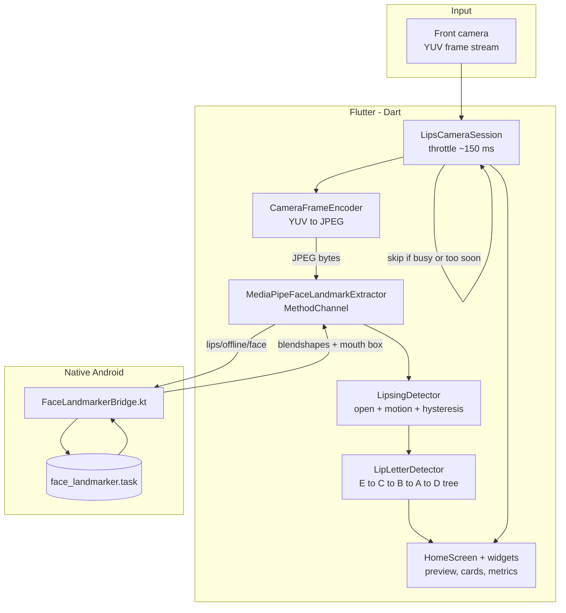
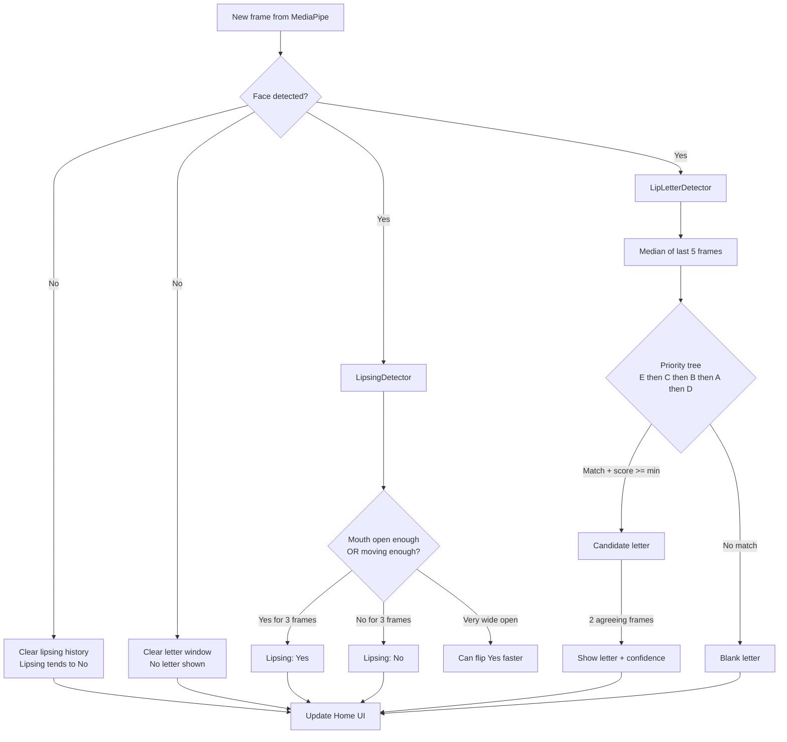
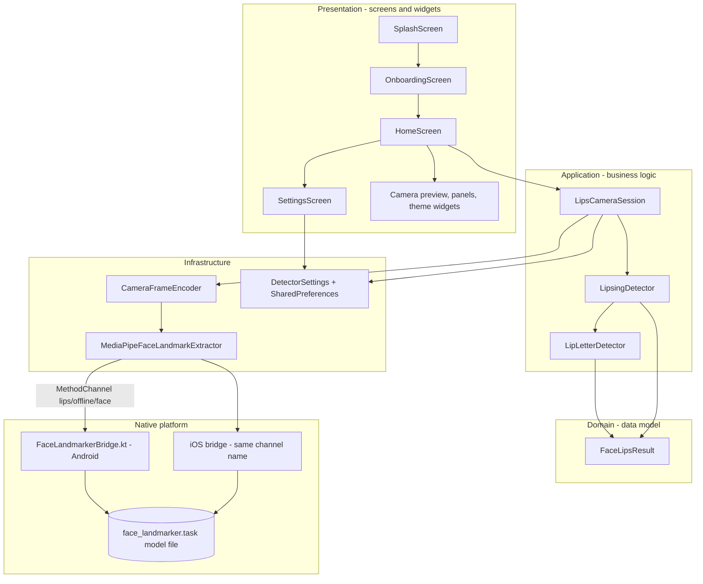
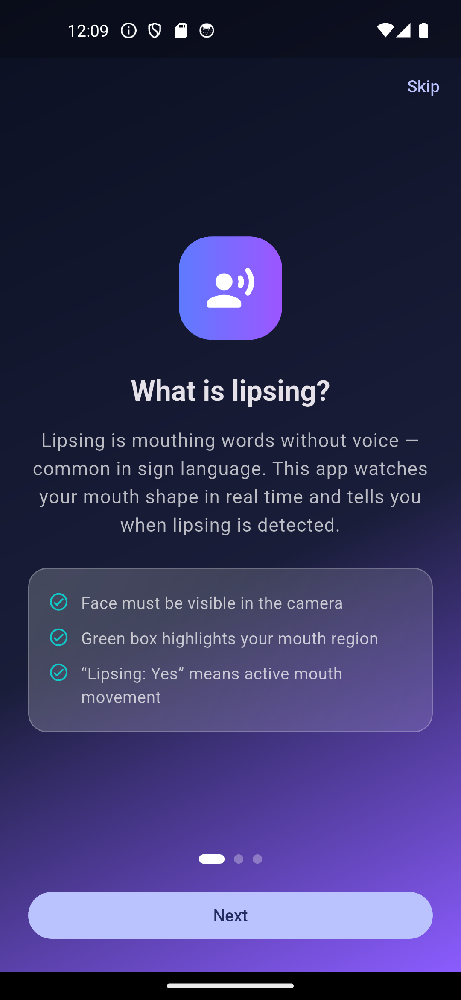
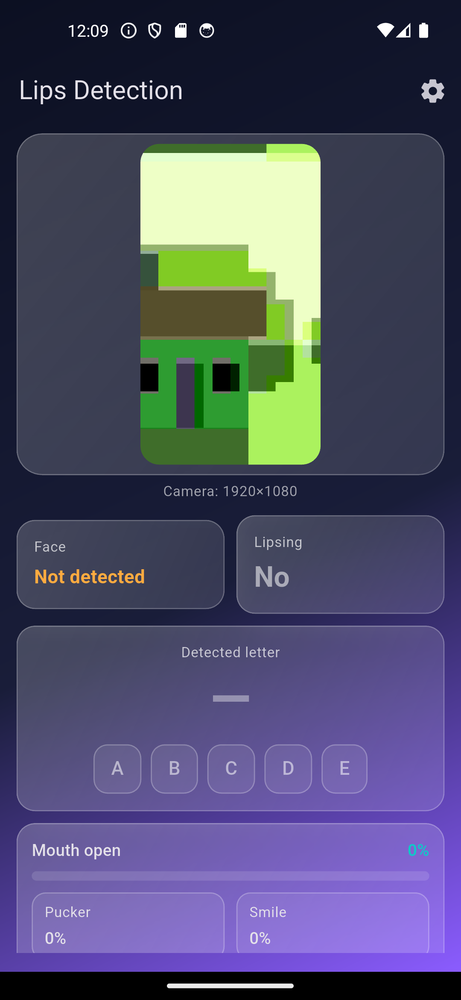
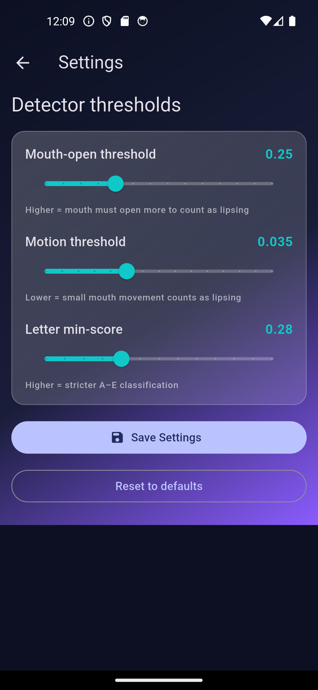

# Lips Offline — Graduation Project

**GitHub:** [minarehan700-eng/GP-Lips-Detection](https://github.com/minarehan700-eng/GP-Lips-Detection)

A Flutter mobile app I built for my graduation project. It uses your phone’s **front camera** to watch your mouth in real time — **fully offline**, with no internet and no cloud server.

The app answers two simple questions:

1. **Are you lipsing?** (moving your mouth as if speaking, but without voice — common in sign language)
2. **Which mouth shape (viseme letter A–E) best matches what you are doing right now?**

> **Viseme** = a mouth shape linked to a speech sound (not a whole word).  
> **Lipsing** = mouthing words silently while signing.

This project is a **standalone** app. It only reuses MediaPipe’s face pipeline — it does **not** include hand signs, dictionaries, login, or other features from the separate Signly project.

### Documentation map

| File | What it is for |
|------|----------------|
| **[`VIVA_CODE_GUIDE.md`](VIVA_CODE_GUIDE.md)** | **Start here to prepare for the discussion.** Explains every important class and function, with likely examiner questions, model answers, and presentation scripts. English + Arabic. |
| [`documentation/DIAGRAMS.md`](documentation/DIAGRAMS.md) | **15 UML, architecture and software-engineering diagrams** — class, package, component, deployment, state machine, activity, sequence, DFD, use case — each generated from the real code and explained |
| [`REFACTOR_REPORT.md`](REFACTOR_REPORT.md) | What was simplified, the feature checklist, the test report, and the honest list of untested areas |
| [`docs/LIPS_OFFLINE_DISSERTATION.md`](docs/LIPS_OFFLINE_DISSERTATION.md) | The full university-style report with diagrams and testing notes |

---

## About

Many sign languages use **lipsing** to make words clearer when the hand sign alone could mean more than one thing. Practicing alone is hard because you cannot easily see your own mouth.

**Lips Offline** gives instant feedback on the phone:

- A live camera preview with a **green box** around your mouth
- **Lipsing: Yes / No**
- A detected letter **A, B, C, D, or E** with a confidence score
- **Practice chips** — tap a letter as your target and check if you get **“Matched!”**

The app does **not** train its own AI model. It uses Google’s **MediaPipe Face Landmarker** (a pre-trained model bundled in the app) to read **blendshapes** — numbers that describe how open, closed, round, or smiley your mouth is. Then simple **rules** turn those numbers into stable labels.

Everything runs on the device. Your video never leaves the phone.

---

## Features

| Feature | What it does |
|--------|----------------|
| **Offline detection** | No Wi‑Fi or mobile data needed after install |
| **Lipsing detection** | Shows Yes when your mouth is open enough or moving enough |
| **Viseme letters A–E** | Classifies mouth shape into five practice letters |
| **Live camera preview** | Front camera with mouth region overlay |
| **Practice targets** | Tap A–E chips; see **Matched!** when detection equals your target |
| **Mouth metrics** | Bars for open, pucker, smile, close, funnel, stretch |
| **Settings** | Three sliders to tune sensitivity (saved on the device) |
| **Onboarding** | Three short pages explain lipsing, letters, and camera tips |
| **Dark UI** | Clean gradient theme built with Flutter Material 3 |

**Viseme cheat sheet (shown on Home):**  
Smile = **E** · Round = **C** · Closed = **B** · Wide open = **A** · Slight open = **D**

---

## How It Works

In plain steps:

1. You open the app → short **splash** → **onboarding** (3 pages) → **Home**.
2. The app asks for **camera permission**, loads the **face landmarker** model, and starts the **front camera**.
3. About every **150 ms**, one camera frame is picked (to save battery and keep things smooth).
4. The frame is converted to **JPEG** and sent to **native Android code** (Kotlin) where MediaPipe runs.
5. MediaPipe returns mouth numbers (**blendshapes**) and a **mouth bounding box**.
6. **LipsingDetector** decides Yes/No using mouth openness + motion over recent frames.
7. **LipLetterDetector** picks letter **A–E** using a fixed priority tree (E → C → B → A → D).
8. Both use **hysteresis** (wait a few agreeing frames) so labels do not flicker every millisecond.
9. **HomeScreen** shows the results. You can open **Settings** to adjust thresholds.

### High-level app flow


### Detection pipeline (one camera frame)



### Lipsing vs letter detection (state flow)



---

## Architecture

The code is split into clear layers so it is easy to explain in a report and easy to maintain.



**Method channel:** `lips/offline/face`

| Method | Purpose |
|--------|---------|
| `initializeFaceLandmarker()` | Loads the model (Android initializes on the main thread — workaround for Android 16 crashes) |
| `processFaceFrame({bytes, width, height, rotation})` | Runs detection; returns blendshapes and mouth box |

---

## Project Structure

```
Gp-Lips-Detection/
├── lib/
│   ├── main.dart                          # App entry, dark theme, splash route
│   ├── core/
│   │   ├── app_theme.dart                 # Colors and Material theme
│   │   ├── app_navigation.dart            # Page transitions
│   │   └── detector_settings.dart         # Saved slider values
│   ├── domain/
│   │   └── face_lips_result.dart          # One frame’s mouth data
│   ├── application/
│   │   ├── lips_camera_session.dart       # Camera + pipeline orchestration
│   │   ├── lipsing_detector.dart          # Lipsing Yes/No logic
│   │   └── lip_letter_detector.dart       # A–E classification tree
│   ├── infrastructure/
│   │   ├── camera_frame_encoder.dart      # Camera YUV → JPEG
│   │   └── mediapipe_face_landmark_extractor.dart  # Flutter ↔ native bridge
│   ├── screens/                           # (see "Why these layer names?" below)
│   │   ├── splash_screen.dart
│   │   ├── home_screen.dart
│   │   ├── settings_screen.dart
│   │   └── onboarding/                    # 3 intro pages
│   └── widgets/                           # Preview, panels, gradient UI
├── test/                                  # 73 automated tests
│   ├── helpers/fake_frames.dart           # Builds fake MediaPipe frames
│   ├── lipsing_detector_test.dart         # Yes/No decision + anti-flicker
│   ├── lip_letter_detector_test.dart      # One test per letter + priority
│   ├── mouth_box_painter_test.dart        # Pixel mapping, mirror, rotation
│   ├── face_lips_result_test.dart         # The shared data model
│   ├── detector_settings_test.dart        # Save / load settings
│   ├── widget_test.dart                   # App start-up
│   ├── onboarding_screen_test.dart        # Page navigation
│   ├── settings_screen_test.dart          # Save workflow
│   └── detected_letter_panel_test.dart    # Practice-target workflow
├── android/
│   └── app/src/main/
│       ├── kotlin/.../FaceLandmarkerBridge.kt
│       └── assets/face_landmarker.task     # Required MediaPipe model
├── ios/                                   # iOS bundle includes same .task file
├── .vscode/settings.json                # Stops the Java extension importing android/
├── docs/
│   ├── LIPS_OFFLINE_DISSERTATION.md       # Full graduation report
│   ├── capture_screenshots.ps1            # Script to capture app screenshots
│   └── screenshots/                       # PNG figures for docs (see below)
├── VIVA_CODE_GUIDE.md                     # Discussion / defence guide
├── REFACTOR_REPORT.md                     # What was simplified, and the test report
└── pubspec.yaml
```

### Why these layer names?

The `lib/` folder uses a **layered architecture**. Each layer may only depend on the ones below it:

| Layer | Folder | Depends on | Holds |
|-------|--------|-----------|-------|
| Presentation | `screens/`, `widgets/` | everything below | What the user sees |
| Application | `application/` | `domain/`, `infrastructure/` | The logic — the camera session and both detectors |
| Domain | `domain/` | nothing | The shared data model, `FaceLipsResult` |
| Infrastructure | `infrastructure/` | `domain/` | Talking to the outside world — the camera format and the native bridge |
| Core | `core/` | — | Settings, colours, page transitions |

**The practical benefit:** the detection logic in `application/` knows nothing about the camera or about Flutter widgets. That is why it can be unit-tested with fake frames on a machine with no phone and no camera — which is exactly what the tests in `test/` do.

---

## Tech Stack

| Layer | Technology | Why |
|-------|------------|-----|
| **UI** | Flutter (Dart ^3.10) | Cross-platform mobile app |
| **Camera** | `camera` plugin | Live front-camera stream (YUV420) |
| **Image encoding** | `image` package | Turn camera frames into JPEG for MediaPipe |
| **Face / mouth AI** | MediaPipe Face Landmarker | On-device face landmarks + blendshapes |
| **Native Android** | Kotlin + MediaPipe Tasks Vision `0.10.29` | Runs the `.task` model via JNI |
| **Native iOS** | Swift/Obj-C + MediaPipeTasksVision `0.10.21` | Same pipeline on iOS (structure ready) |
| **Storage** | `shared_preferences` | Remember settings sliders |
| **Animation** | `flutter_animate` | Splash and card motion |

**Requirements**

- Flutter **3.3+** (tested with Flutter **3.38**)
- **Android 7+** (minSdk **24**) or **iOS 15+**
- Physical device or emulator with a **front camera**
- Bundled model file **`face_landmarker.task`** (see Setup)

---

## Setup / Installation

### 1. Clone the repository

```bash
git clone https://github.com/minarehan700-eng/GP-Lips-Detection.git
cd GP-Lips-Detection
```

### 2. Install Flutter dependencies

```bash
flutter pub get
```

### 3. Add the MediaPipe model (required)

The app needs Google’s face landmarker model file:

**Download:**  
https://storage.googleapis.com/mediapipe-models/face_landmarker/face_landmarker/float16/1/face_landmarker.task

**Place it in both locations:**

- Android: `android/app/src/main/assets/face_landmarker.task`
- iOS: `ios/Runner/face_landmarker.task` (must stay in the Xcode Runner bundle)

This repo is intended to ship with the model already copied from the Signly project. If the file is missing, the app shows a clear error on Home.

### 4. iOS only — CocoaPods

```bash
cd ios
pod install
cd ..
```

---

## How to Run

From the project root:

```bash
flutter devices          # list connected phones / emulators
flutter run              # pick a device when prompted
```

Or target a specific device:

```bash
flutter run -d <device_id>
```

**What you should see**

1. **Splash** (~2.2 s) — animated logo and tagline  
2. **Onboarding** — three pages (you can Skip)  
3. **Home** — live preview, Face / Lipsing cards, letter A–E, metric bars  
4. **Settings** (gear icon) — tune mouth-open, motion, and letter min-score sliders  

Grant **camera permission** when the system asks.

> **Tip:** Face detection works best on a **real phone** with your face in frame. Emulator virtual cameras often show “Face: Not detected”.

---

## How to Build APK

Release APK for Android (install on a phone without USB debugging):

```bash
flutter build apk --release
```

The APK path:

```
build/app/outputs/flutter-apk/app-release.apk
```

**Notes for release builds**

- Release builds keep **minify/shrink disabled** on Android because R8 + MediaPipe JNI has caused native crashes on some Android 15/16 devices.
- Android pins `com.google.mediapipe:tasks-vision:0.10.29` (16 KB page-size aligned for newer Android versions).

Optional smaller split per CPU architecture:

```bash
flutter build apk --split-per-abi --release
```

---

## Testing

The project has **73 automated tests**. They run on any computer with Flutter — no phone, no camera and no emulator needed.

```bash
# Check the code for errors and style problems
flutter analyze          # expected: "No issues found!"

# Run every test
flutter test             # expected: "+73: All tests passed!"

# Run one file
flutter test test/lip_letter_detector_test.dart

# Run with a coverage report
flutter test --coverage
```

### What is covered

| Area | Tests | Examples of what is checked |
|------|-------|------------------------------|
| Lipsing detection | 10 | Wide-open mouth switches on at once; a slightly open mouth waits 3 frames; movement alone counts; losing the face fades to No |
| Letter classification | 17 | One test per letter A–E; a smiling open mouth is E and not A; a strong pucker beats a weak smile; one odd frame cannot change the letter |
| Mouth box geometry | 11 | Fractions map to the right pixels; the front camera mirrors correctly; a sideways frame is rotated; 6,000 random inputs keep mouth-like proportions |
| Data model | 10 | `hasMouthBox` edge cases; `copyWith` does not mutate |
| Settings | 5 | Defaults on a fresh install; save and reload; a partly filled store |
| Settings screen | 6 | Sliders load saved values; Save writes and confirms; Reset does not write |
| Onboarding | 6 | Page order; Next / Skip; Get Started on the last page |
| Practice panel | 7 | "Matched!" appears only on a real match; tapping a chip reports the letter |
| App start-up | 3 | The app opens on splash and moves on to onboarding |

### What cannot be tested automatically

Anything that needs real camera hardware: opening the camera, MediaPipe model loading, live face detection, and the YUV→JPEG conversion of a real frame. Those must be checked by running the app on a physical phone. See [`REFACTOR_REPORT.md` §6](REFACTOR_REPORT.md) for the manual checklist.

---

## Every letter, and every digit — honestly

The detector reports five shapes. That is not a shortcut, and adding twenty-one
more would not be an improvement: **"p", "b" and "m" are the same mouth shape.**
They are articulated in different places inside the mouth, but the lips do
exactly the same thing, so no camera can separate them. An app that claimed
otherwise would return confident wrong answers.

So the alphabet is covered by **grouping**, not by dropping:

| Shape | Mouth | Letters and sounds |
|-------|-------|--------------------|
| **A** | jaw dropped, wide | a, ah, aa |
| **B** | lips pressed together | p, b, m |
| **C** | pushed forward, round | o, u, w, oo, ow |
| **D** | slightly open, tongue working | t, d, n, l, s, z, k, g, r, h, j, c, q, x, th, f, v |
| **E** | pulled wide, small smile | e, i, y, ee |

A test asserts that every letter from a to z maps to a shape, so the claim that
nothing is missing is checked rather than asserted.

**Digits** are practised as the words for them — "zero" through "ten" are in the
word library. A digit is not a mouth shape, but the word for it is a run of
shapes like any other.

**Words are where lip reading actually works.** One shape is ambiguous; a
*sequence* of them is far less so. "mama" is closed-open-closed-open, and few
words share that pattern. Word practice walks through a word shape by shape,
with a shorter hold than single-letter practice — holding each shape for the
full letter duration turns a four-shape word into an unnatural performance.

The word library covers greetings, the digits, emergency words and everyday
words. It is English: the grapheme-to-shape rules are English, and other
scripts need their own.

### What would be needed for true 26-letter detection

Fingerspelling — the sign-language alphabet — genuinely has 26 distinct letters
and 10 digits, because they are made with the **hands**, not the lips. That is a
different pipeline: MediaPipe's Hand Landmarker, a second model file, and new
code in both native bridges. It is a real and worthwhile direction, and it is
not in this build.

---

## Calibration

The shipped thresholds were measured on a few faces. Yours is probably not one
of them — mouth size, lip shape, beard, camera distance and lighting all move
the raw readings, so the same `0.25` that is a wide-open mouth on one person is
a resting face on another.

Calibration replaces the guess with a measurement. Four short holds — rest,
wide open, rounded, spread — and the app derives your own thresholds.

The interesting step is **rest**. Its *spread* — how much the readings wobble
while you are deliberately holding still — is your noise floor, and a motion
threshold below it would fire on a motionless face. The motion threshold is set
at 2.5× that wobble.

A calibration is **refused, with a reason**, when it cannot be trusted:

| Refused when | Because |
|---|---|
| A step never got enough frames | Your face was not visible long enough |
| Rest and wide-open measured the same | The mouth was probably never opened |
| The resting face would not hold still | A moving camera or very poor light |

Silently accepting any of those would leave you with thresholds *worse* than
the defaults and nothing to explain why detection got worse. The median is used
rather than the mean throughout, so one dropped frame does not drag a whole
step.

## What you mix up

A per-letter accuracy score throws away the most useful thing: *what you made
instead*. "You get C wrong" is not actionable. **"You make D when you mean C"**
tells you your lips are stopping at neutral instead of rounding.

So each missed attempt records the shape that kept turning up — but only when
one shape accounts for more than half the wrong frames. Every attempt passes
through two or three shapes on the way to the right one; that is normal and
says nothing. Returning repeatedly to one of them says something.

It is also a diagnosis of the **detector**, not only the user. If everyone
confuses the same pair, the thresholds separating those two shapes are wrong.

## The lock

Practice history says how well you can make speech shapes. That is
health-adjacent information about a disability, on a phone families share.

- The PIN is stored as **PBKDF2-HMAC-SHA256**, 120 000 rounds, with a random
  16-byte salt per device. The PIN itself is never written down.
- Comparison is **constant-time**, so how long a check takes says nothing about
  how much of a guess was right.
- Three free tries, then a **doubling lock-out** up to 30 minutes. A four-digit
  PIN is ten thousand guesses; unthrottled that is a couple of minutes of
  scripting.
- Removing the PIN requires the current one.

The PBKDF2 is written out rather than pulled from a package — it is twenty
lines — and is checked against **four published RFC test vectors**. An
implementation nobody has verified against a known answer is not worth trusting
with a PIN.

> **What this is not.** It is not a login. There is no account, no server and no
> password reset, because the app has no network code at all. It also does not
> defend against a rooted phone with a debugger attached: `shared_preferences`
> is not encrypted storage. Claiming otherwise would be worse than claiming
> nothing.

---

## Practice mode

The home screen answers *"what shape am I making?"*. That is a demonstration.
Practice answers *"am I getting better?"*, which is what somebody actually
learning needs — and it is the only place a result is written down.

A round presents each letter in turn and asks you to **hold** that mouth shape.

**Holding, not hitting.** A letter counts only once the shape has been held for
about 700 ms. One good frame is not evidence of anything: the classifier passes
through neighbouring shapes on its way to the right one, so crediting a single
frame would score the shapes you merely flickered through. Lose the shape and
the hold restarts from nothing — accumulating it across gaps would pass someone
who flickered onto the letter repeatedly without ever holding it.

**Nobody gets stranded.** Each letter has a 12-second limit. Run out and it is
marked missed and the round moves on, so a shape you cannot yet make does not
end the session.

**The order changes every round.** In a fixed order people learn the sequence
rather than the shapes, and start forming the next one before it is asked for.

**A near miss is not the same as a miss.** The best confidence reached is kept
even for a failed attempt, so "you were close on C" can be told apart from
"you were nowhere near".

## Progress

Every finished round is saved on the phone — there is no network code in this
app and practice data is not the place to introduce any.

The screen shows how each letter is going, and the line that matters is at the
bottom: **which shape to work on next**. A letter tried fewer than three times
is never named as your weakness, because one unlucky attempt is not evidence.
Untried letters still get a row — knowing you have never attempted C is itself
useful.

History is capped at 200 rounds. `shared_preferences` loads wholly into memory
at start-up, so an unbounded list would slow the launch a little more every time
you practised. A row that cannot be read — written by an older version, or a
write cut short — is skipped rather than costing you the rest of your history.

`PracticeHistoryStore.toCsv` renders the history as CSV for a report; the rows
drop straight into a spreadsheet.

---

## Languages and accessibility

The app ships in **English, Arabic, Spanish and French**, and picks the phone's
language on first launch. It can be changed at any time under **Settings →
Language**, and the choice is remembered.

Arabic is a right-to-left language, so choosing it mirrors the whole interface:
the Skip button moves to the left, sliders run the other way, and text aligns
to the right. That is handled by Flutter once the locale is set, which is why
positions are written as `AlignmentDirectional.centerEnd` rather than
`centerRight` — the latter would stay stubbornly on the right in Arabic.

### Accessibility

| Feature | What it does | Where |
|---------|--------------|-------|
| **Spoken detections** | Each detected letter, and the face appearing or disappearing, is sent to TalkBack or VoiceOver. Without this a screen-reader user gets nothing at all, because the result only ever appears as text that never takes focus | Settings → *Speak detections aloud* |
| **Vibrate on a match** | The phone buzzes when your mouth shape matches the letter you are practising. This is the one confirmation that works while you are looking at your own face rather than the screen — and for a deaf user, a sound would not | Settings → *Vibrate on a match* |
| **Labelled letter chips** | Each chip announces its letter, whether it is the current practice target, and what tapping will do. Selection is not signalled by colour alone | `LetterChip` in `lib/widgets/detection_ui.dart` |
| **Large text** | Onboarding scrolls instead of clipping when the system font is scaled up. At 2× it needed about 1400 px more height than the screen has | `lib/screens/onboarding/onboarding_page.dart` |

Both switches are on by default, and both are announced only when the detection
*changes* — the pipeline produces about seven results a second, and speaking
every one of them would make a screen reader unusable.

### Adding a language

1. Copy `lib/l10n/app_en.arb` to `lib/l10n/app_<code>.arb` and translate the
   values. Leave the keys and anything in `{braces}` exactly as they are — a
   placeholder that is renamed throws at runtime, and one that is dropped
   prints as literal text.
2. Run `flutter gen-l10n` (or just `flutter pub get`).
3. Add the language's own name to `_LanguagePicker._endonyms` in
   `lib/screens/settings_screen.dart` — someone looking for Arabic is looking
   for "العربية", not "Arabic".
4. Run `flutter test test/localization_test.dart`. It fails if the new file is
   missing a key, invents one, changes a placeholder, or leaves a string
   identical to the English original.

Nothing else needs touching: the picker and the supported-locale list are both
built from the `.arb` files.

> **A note on the translations.** The English and Arabic wording was written
> directly. The Spanish and French are careful but have not been reviewed by a
> native speaker — worth doing before publishing to those markets.

---

## Common Errors and Solutions

> **Before anything else, run the setup script once.** `setup_windows.bat` on Windows, or
> `./setup_macos_linux.sh` on macOS and Linux. It fixes the first three rows of this table
> automatically, for whatever machine it is run on.

| Error / symptom | Cause | Fix |
|-----------------|-------|-----|
| **`Settings file 'android\settings.gradle.kts' line: 5` … `local.properties (The system cannot find the file specified)`** | `android/local.properties` records where Flutter lives on **this** computer. It is deliberately not in version control, and it is only written the first time the Flutter tool runs — but an IDE syncs Gradle the moment you open the folder, which is sooner than that | Run **`flutter pub get`** once in the project root (the folder holding `pubspec.yaml`), then reload the window. `setup_windows.bat` does this for you. `android/settings.gradle.kts` now also falls back to the `FLUTTER_ROOT` environment variable, and prints this instruction instead of a stack trace |
| **`Value 'C:\Program Files\Android\Android Studio\jbr' ... does not exist`** when building | An older copy of `android/gradle.properties`. It used to carry a JDK path and a truststore path belonging to one Windows machine, and neither exists anywhere else | Fixed at source — those lines are gone from `android/gradle.properties`, which now holds no machine-specific settings at all. If you still see this, you are on an old copy: pull the latest, or delete every line under the old "MACHINE-SPECIFIC SETTINGS" banner by hand |
| **`Dependency requires at least JVM runtime version 11. This build uses a Java 8 JVM.`** | Gradle 8.14 and the Android Gradle Plugin need **JDK 17 or newer**, but the `java` on your PATH is Java 8 | Run the setup script — it finds a JDK 17 (the one bundled with Android Studio is always new enough) and registers it. By hand: `flutter config --jdk-dir "<path to a JDK 17>"`, using `C:\Program Files\Android\Android Studio\jbr` on Windows, `/Applications/Android Studio.app/Contents/jbr/Contents/Home` on macOS, or `/opt/android-studio/jbr` on Linux. Then **end the old Gradle daemon** — it stays alive under the old JDK and keeps repeating this error after the setting is fixed: `pkill -f GradleDaemon` on macOS/Linux, or close VS Code and Android Studio on Windows. Confirm with `flutter doctor -v`, whose **Java version** line under *Android toolchain* must read 17 or newer. Do **not** add `org.gradle.java.home` to `android/gradle.properties` — that is what made the file unusable on other machines before |
| **`Could not run phased build action using connection to Gradle distribution`** popping up in VS Code | This is *"Extension Pack for Java"*, which sees `android/` and imports it as a Gradle project on its own. `flutter run` and `flutter build apk` drive Gradle directly and never use that import, so the popup is noise from an unrelated consumer of the build | Already handled — `.vscode/settings.json` in this repository sets `java.import.gradle.enabled` to `false`, which switches the import off. Reload the window (**Ctrl+Shift+P → Developer: Reload Window**) after pulling it. If the message mentions the Java version as well, fix the JDK using the row above — that half is real and does affect the build |
| **Truststore / SSL error** during a Gradle build | Antivirus (AVG, Kaspersky, ESET and others) inspects HTTPS by presenting its own certificate authority. Windows trusts it; Java keeps a separate list and does not | This is genuinely local, so it is no longer committed. Add it to **your own** `%USERPROFILE%\.gradle\gradle.properties` — not to the project — after exporting the antivirus certificate into a keystore: `systemProp.javax.net.ssl.trustStore=<path to your .jks>` and `systemProp.javax.net.ssl.trustStorePassword=changeit` (`changeit` is Java's stock keystore password, not a secret) |
| **"Initialization failed: ... face_landmarker.task"** on the Home screen | The model file is missing | Make sure `android/app/src/main/assets/face_landmarker.task` and `ios/Runner/face_landmarker.task` both exist. Both are committed to this repository |
| **"Face: Not detected"** that never changes | Running on an emulator, or poor lighting | Use a **physical phone**. Emulator virtual cameras show an animated scene, not a real face |
| **Camera preview is black / app shows an error** | Camera permission was denied | Grant camera permission in the phone's app settings, then tap **Try Again** |
| **"No camera found on this device."** | The device reports no cameras | Use a device with a front camera |
| **Lipsing says Yes too easily or never** | The thresholds do not suit your face or lighting | Open **Settings** and adjust the sliders, then Save |
| **App crashes on Android 15/16 in a release build** | R8 minification breaking MediaPipe's JNI | Already handled — `isMinifyEnabled = false` in `android/app/build.gradle.kts`. Do not re-enable it |
| **`flutter pub get` resolves different versions** | `pubspec.lock` was ignored | Commit and use the `pubspec.lock` in this repository |

---

## Limitations

Stated honestly — see [`REFACTOR_REPORT.md` §9](REFACTOR_REPORT.md) for the full list.

- **Not speech recognition.** The app reports mouth *shapes*, not words. Different sounds share the same shape (for example "p", "b" and "m" all look like closed lips), so lips alone cannot identify a word.
- **Rule-based, not machine-learned.** The thresholds were chosen by testing, not fitted to a dataset.
- **No measured accuracy figure is claimed.** No labelled test set was collected, so quoting a percentage would be dishonest.
- **Lighting, camera angle and distance affect the results.**
- **One face only** (`setNumFaces(1)`).
- **About 7 analyses per second**, a deliberate trade-off for battery life.
- **iOS has not been tested on a physical device.** The Swift bridge mirrors the Kotlin one and is structurally complete.
- **The JDK is not configured by the repository.** `android/gradle.properties` is now free of machine-specific paths, so each computer points Flutter at its own JDK 17 once, via the setup script or `flutter config --jdk-dir`. See the table above.

---

## Screenshots

Screenshots live in [`docs/screenshots/`](docs/screenshots/). They are used in the dissertation report. If PNG files are not in your clone yet, run the app on a device and capture them with [`docs/capture_screenshots.ps1`](docs/capture_screenshots.ps1).

| # | File | Screen |
|---|------|--------|
| 1 | `docs/screenshots/01_splash.png` | Splash (short 2.2 s branding) |
| 2 | `docs/screenshots/02_onboarding_lipsing.png` | Onboarding — What is lipsing? |
| 3 | `docs/screenshots/03_onboarding_letters.png` | Onboarding — Letters A–E |
| 4 | `docs/screenshots/04_onboarding_camera.png` | Onboarding — Camera tips |
| 5 | `docs/screenshots/05_home_idle.png` | Home — layout / idle state |
| 6 | `docs/screenshots/06_home_lipsing.png` | Home — lipsing active (best on real device) |
| 7 | `docs/screenshots/07_home_letter.png` | Home — detected letter |
| 8 | `docs/screenshots/08_home_matched.png` | Home — target matched |
| 9 | `docs/screenshots/09_settings.png` | Settings sliders |

<p align="center">
  
  
  
</p>

*If images do not show above, the PNG files may not be committed yet — run the capture script after `flutter run` on a device.*

---

## Default Settings

| Setting | Default | Meaning |
|---------|---------|---------|
| Mouth-open threshold | `0.25` | How open the mouth must be to count as “active” |
| Motion threshold | `0.035` | How much mouth movement counts as lipsing |
| Letter min-score | `0.28` | Minimum confidence to show a letter |

These are stored with keys in `DetectorSettings` and reload when you return from Settings.

The slider ranges live next to the defaults in the same file, so every tuning number is in one place:

| Setting | Slider range | Steps |
|---------|--------------|-------|
| Mouth-open threshold | `0.05` – `0.70` | 13 |
| Motion threshold | `0.010` – `0.080` | 14 |
| Letter min-score | `0.10` – `0.70` | 12 |

---

## Future Work

Ideas I would add with more time:

- **Skip onboarding** after first launch (save a flag in SharedPreferences)
- **More visemes** or full alphabet — extend the rule tree or add a small trained classifier
- **User calibration** — short “hold B closed” tuning step per person
- **Formal accuracy study** — labelled video clips and a confusion matrix
- **Stronger iOS testing** — verify parity with the Android bridge on real iPhones
- **Results history** — show the last few detected letters so progress is visible
- **Make the Gradle build portable** — move the machine-specific lines out of `android/gradle.properties`

Each idea is written up with its benefit, affected files, complexity and test plan in [`REFACTOR_REPORT.md` §8](REFACTOR_REPORT.md).

---

## License & Acknowledgements

- **MediaPipe Face Landmarker** — Google; used under the project’s model licence  
- Built as a graduation project demo — rule-based viseme feedback, not full speech recognition  

---

## Related Documentation

- [`VIVA_CODE_GUIDE.md`](VIVA_CODE_GUIDE.md) — **code discussion guide** (English + Arabic): every important class explained, likely examiner questions with model answers, and 60-second / 3-minute / 10-minute presentation scripts
- [`REFACTOR_REPORT.md`](REFACTOR_REPORT.md) — what was simplified and why, the feature preservation checklist, the full test report, and the honest list of untested areas
- [`docs/LIPS_OFFLINE_DISSERTATION.md`](docs/LIPS_OFFLINE_DISSERTATION.md) — full report (requirements, testing, extra diagrams)
- [`docs/README.md`](docs/README.md) — docs folder index
