# Lips Offline — Graduation Project Report

**Student Name:** [Your Name]  
**Supervisor:** [Supervisor Name]  
**University:** [University Name]  
**Programme:** [Degree / Department]  
**Date:** August 2026  

---

## Abstract

**Lips Offline** is a standalone Flutter mobile app that runs fully on the device without internet. It uses the front camera and Google MediaPipe Face Landmarker to watch the user’s mouth in real time. The app answers two simple questions: *Is the user lipsing?* (mouthing without voice) and *Which viseme letter A–E best matches the current mouth shape?*

A **viseme** is a mouth shape that stands for a speech sound. In sign language, **lipsing** is mouthing words silently while signing. This project does not train a custom neural network. Instead, it reads **blendshapes** (numeric mouth pose scores from MediaPipe) and applies clear, rule-based logic with short **hysteresis** so the on-screen labels do not flicker every frame.

The report explains the problem, related work, system design, implementation, testing, and results. All behaviour described here comes from the code in this repository’s `lib/` folder and `FaceLandmarkerBridge.kt`.

---

## Attestation

I confirm that this report describes my own work on the **Lips Offline** application. Placeholder names above should be replaced before submission.

**Signature:** _________________________  
**Date:** _________________________  

---

## Acknowledgements

Thanks to [Supervisor Name] for guidance, and to the MediaPipe team for the open Face Landmarker task model used under the project licence.

---

## Contents

1. [Introduction](#chapter-1-introduction)  
2. [Related Work](#chapter-2-related-work)  
3. [Proposed Solution and System Analysis](#chapter-3-proposed-solution-and-system-analysis)  
4. [Implementation](#chapter-4-implementation)  
5. [Testing and Evaluation](#chapter-5-testing-and-evaluation)  
6. [Results and Discussion](#chapter-6-results-and-discussion)  
7. [Conclusions and Future Work](#chapter-7-conclusions-and-future-work)  
8. [References](#references)  
9. [Appendix](#appendix)  

---

## List of Figures

| Figure | Description |
|--------|-------------|
| 1 | System context |
| 2 | Use-case diagram |
| 3 | Layered architecture |
| 4 | Screen navigation |
| 5 | Data-flow pipeline |
| 6 | Sequence of one camera frame |
| 7 | Viseme decision tree (E → C → B → A → D) |
| 8 | Project Gantt chart |
| 9–17 | App screenshots (splash through settings) |

---

## List of Tables

| Table | Description |
|-------|-------------|
| 1 | Functional requirements |
| 2 | Non-functional requirements |
| 3 | Comparison with other lip/mouth approaches |
| 4 | Default detector thresholds |

---

# Chapter 1: Introduction

## 1.1 What the app does

**Lips Offline** is a small Android-focused Flutter app. After a short splash and three onboarding pages, the user reaches a **home screen** with:

- Live **front-camera preview**
- **Face** status (detected / not detected)
- **Lipsing** status (Yes / No)
- **Detected letter** (A–E or blank) with a confidence percentage
- **Letter chips** A–E to pick a practice **target**
- **Mouth metrics** (open, pucker, smile, close, funnel, stretch)
- **Settings** with three sliders that tune detection

Everything runs **offline**. No login, no cloud API, and no hand-sign recognition — only mouth analysis.

## 1.2 Why mouthing matters in sign language

Many sign languages use **lipsing** to clarify which word is meant when the hand sign alone is ambiguous. Learners and interpreters benefit from feedback: *Am I actually moving my mouth?* and *Does my mouth shape match the viseme I intend?* This app gives lightweight, instant feedback for practice — not full sentence lip reading.

## 1.3 Problem statement

Manual feedback requires a partner or video review. A phone app that works offline could give immediate cues during solo practice. The hard parts are:

1. Tracking the mouth reliably on a moving face under normal room light.
2. Turning raw pose numbers into stable Yes/No lipsing and A–E labels.
3. Keeping latency low enough to feel “live” on mid-range phones.

## 1.4 Scope

**In scope**

- Viseme letters **A, B, C, D, E** only (not full alphabet or words).
- **Offline** MediaPipe Face Landmarker on **Android** (Kotlin bridge).
- **Front camera**, single face, rule-based classifiers.
- UI: splash, onboarding, home, settings.

**Out of scope**

- Signly ASL hands, TFLite hand models, dictionary, authentication, or any feature from the separate `mobile_offline` project.
- Trained deep lip-reading models or word-level speech recognition.
- iOS build verification in this report (code structure supports it; testing focused on Android).

## 1.5 Objectives

1. Load MediaPipe Face Landmarker from bundled `face_landmarker.task`.
2. Stream camera frames, extract mouth blendshapes and a mouth bounding box.
3. Detect **lipsing** from mouth openness and short-term motion.
4. Classify **A–E** with an exclusive priority tree and hysteresis.
5. Persist user threshold settings with `SharedPreferences`.
6. Present a clear, dark-themed UI with onboarding help text.

## 1.6 Methodology

Work followed a simple iterative path:

1. **Research** — lip reading, visemes, MediaPipe Face Landmarker.
2. **Requirements** — list what the real screens must do.
3. **Design** — layered modules, data flow, decision tree.
4. **Implement** — Flutter UI, camera session, Kotlin bridge.
5. **Test manually** — permissions, settings, stable labels, error paths.
6. **Document** — this report with diagrams and screenshots.

## 1.7 Report map

- **Chapter 2** — related work and comparison table.  
- **Chapter 3** — requirements, use cases, architecture, detector design.  
- **Chapter 4** — code structure and short excerpts.  
- **Chapter 5** — testing scenarios and honest limits.  
- **Chapter 6** — screenshot walkthrough.  
- **Chapter 7** — conclusions and future work.  

## 1.8 Work plan (Gantt)

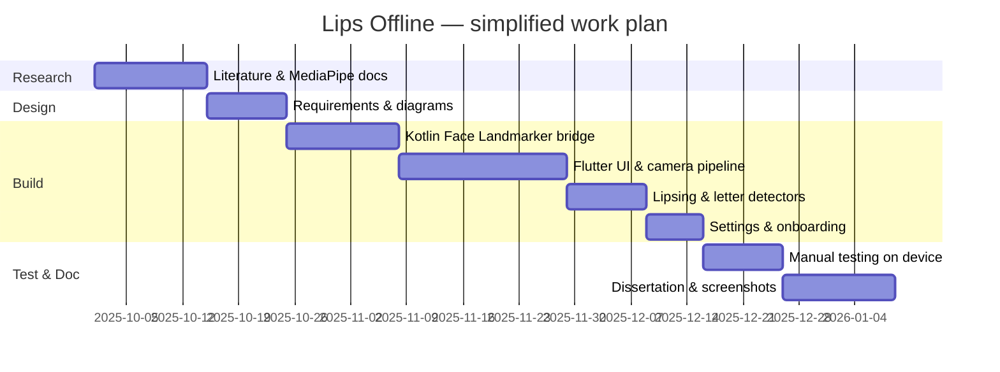

---

# Chapter 2: Related Work

## 2.1 Lip reading and visemes (plain language)

**Automatic lip reading** tries to guess spoken words from video of the mouth. Research systems often use large labelled video datasets and deep networks (for example CNN–LSTM or transformer models). They can reach useful word accuracy under controlled conditions, but need training data, compute, and usually do not run fully offline on a phone for arbitrary speakers.

A **viseme** is a smaller unit: a mouth **shape** linked to a speech sound, not a whole word. Mapping visemes is easier than full lip reading because the label set is tiny. Sign-language **lipsing** care about *whether* the mouth is active and *which shape* it resembles — a good fit for viseme-style rules.

## 2.2 MediaPipe Face Landmarker

Google’s **Face Landmarker** task detects one face, outputs 3D landmarks, and can emit **face blendshapes** — scores from 0 to 1 for poses like `jawOpen`, `mouthPucker`, and `mouthSmileLeft`. The model ships as a `.task` file and runs on-device through MediaPipe Tasks. This project sets `setOutputFaceBlendshapes(true)` and reads mouth-related categories in Kotlin, then sends compact numbers to Flutter over a **method channel**.

A **landmarker** here means the model that finds facial points; a **blendshape** is a standard named mouth/face pose with a strength score.

## 2.3 Rule-based vs learned lip classifiers

Learned models can adapt to many speakers but need datasets and training pipelines. **Rule-based** classifiers use thresholds on blendshapes — faster to explain in a graduation report and cheap to run, but less flexible across all faces and lighting.

## 2.4 Comparison table

| Aspect | Deep lip-reading CNN | MediaPipe + rules (this app) |
|--------|----------------------|------------------------------|
| Training data | Large video corpora | None (pretrained landmarker only) |
| Output | Words / phonemes | Lipsing Yes/No + letters A–E |
| Offline | Often needs server or heavy model | Yes, bundled `.task` file |
| Explainability | Low | High (thresholds & tree) |
| Latency | Depends on model size | ~150 ms min interval between processed frames |
| Scope | General speech | Practice visemes for signing |

---

# Chapter 3: Proposed Solution and System Analysis

## 3.1 System context

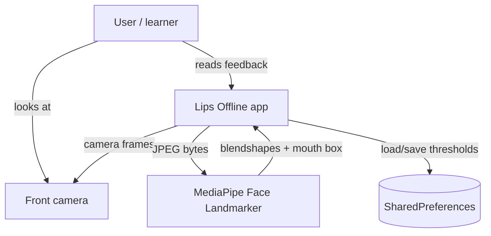

The user is the only actor. The app never sends video off the device.

## 3.2 Functional requirements

| ID | Requirement | Source in app |
|----|-------------|---------------|
| FR1 | Show splash then onboarding on cold start | `SplashScreen`, `OnboardingScreen` |
| FR2 | Explain lipsing and letters A–E | `OnboardingPageData` |
| FR3 | Request and use front camera | `LipsCameraSession` |
| FR4 | Show face detected / not detected | `HomeScreen` status card |
| FR5 | Show lipsing Yes / No | `LipsingDetector` |
| FR6 | Show detected letter A–E with confidence | `LipLetterDetector` |
| FR7 | Allow target letter selection on chips | `DetectedLetterPanel` |
| FR8 | Show “Matched!” when target equals detected | `lips_detection_panels.dart` |
| FR9 | Draw mouth region box on preview | `MouthBoxPainter` |
| FR10 | Adjust three thresholds in settings | `SettingsScreen`, `DetectorSettings` |
| FR11 | Work offline | No network calls in codebase |

## 3.3 Non-functional requirements

| ID | Requirement | How addressed |
|----|-------------|---------------|
| NFR1 | Responsiveness | Skip frames if still processing; min 150 ms between analyses |
| NFR2 | Stability | Hysteresis in both detectors |
| NFR3 | Fail clearly | Error screen if camera or model missing |
| NFR4 | Usability | Dark theme, onboarding tips, metric bars |
| NFR5 | Maintainability | Layers: screens / application / domain / infrastructure |

## 3.4 Use cases

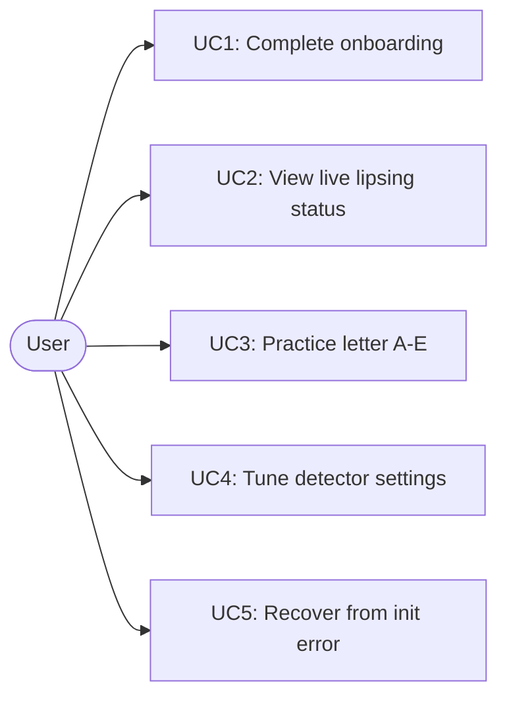

- **UC1** — User reads three pages (or skips) and opens home.  
- **UC2** — User holds face to camera; app shows Face + Lipsing cards.  
- **UC3** — User mouths a shape; taps a chip as target; checks letter and “Matched!”.  
- **UC4** — User opens Settings, moves sliders, saves.  
- **UC5** — User taps “Try Again” if camera or model failed.  

## 3.5 Layered architecture

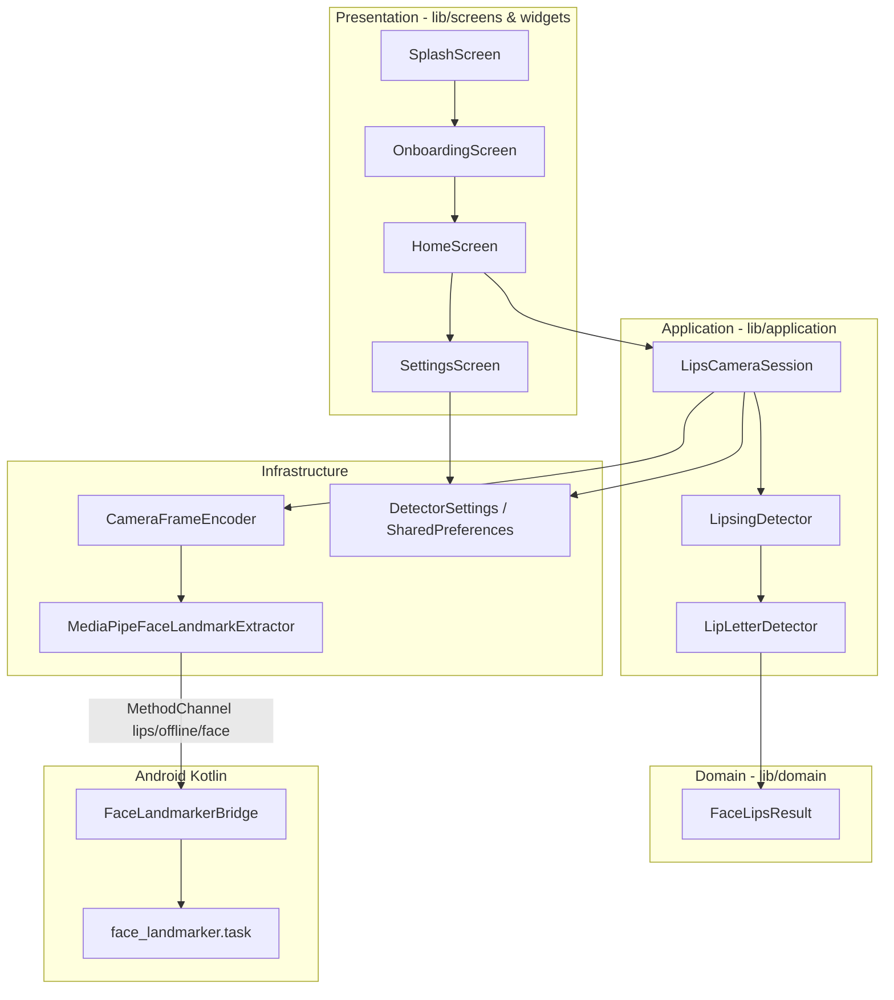

## 3.6 Screen navigation

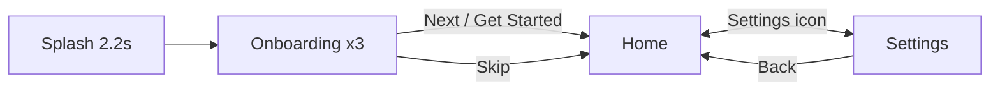

Onboarding is shown on **every** cold start (`OnboardingScreen` comment); there is no “already seen” flag yet.

## 3.7 Data flow (one frame)

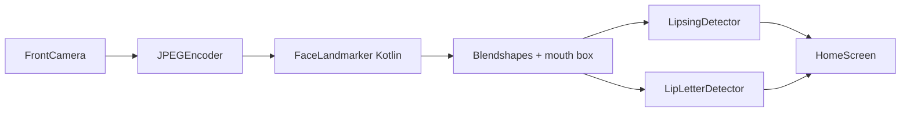

## 3.8 Sequence of one camera frame

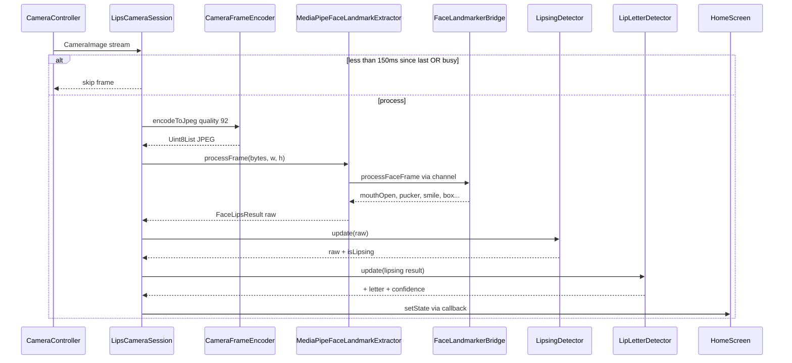

## 3.9 Lipsing detector design

`LipsingDetector` keeps the last **8** mouth samples. Each frame it checks:

- **Open enough:** `mouthOpen > mouthOpenThreshold` (default **0.25**).
- **Motion enough:** average absolute change in open / pucker / smile beats **motionThreshold** (default **0.035**).

If either is true for **3** consecutive frames (`hysteresisFrames`), lipsing turns **Yes**. Turning off also needs **3** quiet frames. A very open mouth (`mouthOpen > threshold × 1.4`) can flip Yes faster.

## 3.10 Viseme letter detector and decision tree

`LipLetterDetector` merges blendshape **open** (85%) with mouth box height/width (15%), then takes a **median** over the last **5** frames to reduce noise.

**Exclusive priority: E → C → B → A → D** — first match wins:

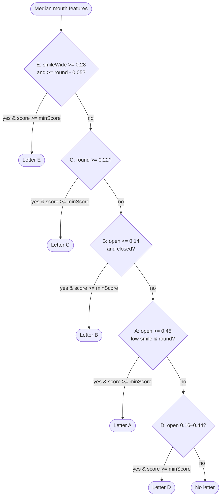

| Letter | Intended mouth shape | Main cues |
|--------|----------------------|-----------|
| A | Wide open | High `open`, low smile/pucker |
| B | Closed | Low `open`, high `mouthClose` |
| C | Round / puckered | High `pucker` or `funnel` |
| D | Slightly open | Mid `open` band |
| E | Smile | High `smile` or `stretch` |

Default **minScore** = **0.28**. Letter display stabilizes after **2** agreeing frames.

---

# Chapter 4: Implementation

## 4.1 Project layout

| Path | Role |
|------|------|
| `lib/main.dart` | App entry, theme, splash route |
| `lib/screens/` | Splash, onboarding, home, settings |
| `lib/widgets/` | Camera preview, panels, theme widgets |
| `lib/application/` | Camera session, detectors |
| `lib/domain/face_lips_result.dart` | Shared result model |
| `lib/infrastructure/` | JPEG encoder, method channel |
| `lib/core/` | Theme, navigation, settings keys |
| `android/.../FaceLandmarkerBridge.kt` | MediaPipe on Android |
| `android/app/src/main/assets/face_landmarker.task` | Bundled model |

## 4.2 App entry

`main.dart` starts a dark Material app whose home is `SplashScreen`:

```dart
void main() {
  WidgetsFlutterBinding.ensureInitialized();
  runApp(const LipsOfflineApp());
}

class LipsOfflineApp extends StatelessWidget {
  @override
  Widget build(BuildContext context) {
    return MaterialApp(
      debugShowCheckedModeBanner: false,
      title: 'Lips Offline',
      theme: AppTheme.dark(),
      home: const SplashScreen(),
    );
  }
}
```

**What this does:** Ensures Flutter bindings exist, then shows the splash route first.

## 4.3 Camera session pipeline

`LipsCameraSession` owns the camera, encoder, extractor, and both detectors. On each frame it skips work if a previous frame is still running or if less than **150 ms** passed:

```dart
Future<void> _onFrame(CameraImage image, void Function() onUpdate) async {
  if (_isProcessing) return;
  final now = DateTime.now();
  if (now.difference(_lastProcessed).inMilliseconds < 150) return;
  _lastProcessed = now;
  _isProcessing = true;
  try {
    final jpeg = await _encoder.encodeToJpeg(image, quality: 92);
    if (jpeg == null) return;
    final raw = await _extractor.processFrame(
      bytes: jpeg, width: image.width, height: image.height, rotation: 0,
    );
    final lipsing = _lipsingDetector.update(raw);
    result = _lipLetterDetector.update(lipsing);
    onUpdate();
  } finally {
    _isProcessing = false;
  }
}
```

**What this does:** Throttles analysis, converts YUV camera data to JPEG, runs face detection, then updates lipsing and letter state.

## 4.4 Flutter ↔ Kotlin bridge

Dart calls channel `lips/offline/face`:

```dart
static const MethodChannel _channel = MethodChannel('lips/offline/face');

Future<void> initialize() async {
  await _channel.invokeMethod('initializeFaceLandmarker');
}

Future<FaceLipsResult> processFrame({...}) async {
  final response = await _channel.invokeMapMethod<String, dynamic>(
    'processFaceFrame',
    {'bytes': bytes, 'width': width, 'height': height, 'rotation': rotation},
  );
  // maps mouthOpen, mouthPucker, smile, mouth box, etc.
}
```

**What this does:** Loads the native landmarker once, then sends each JPEG to Kotlin and maps the returned map into `FaceLipsResult`.

## 4.5 Kotlin: blendshapes and mouth box

`FaceLandmarkerBridge` decodes JPEG to bitmap, runs `FaceLandmarker.detect`, and reads blendshape names. Lip indices **61, 291, 0, 17, 13, 14** build a tight outer-lip box:

```kotlin
val mouthOpen = blendshapes["jawOpen"] ?: 0.0
val mouthPucker = blendshapes["mouthPucker"] ?: 0.0
val smile = ((blendshapes["mouthSmileLeft"] ?: 0.0) +
             (blendshapes["mouthSmileRight"] ?: 0.0)) / 2.0
// ...
val lipIndices = intArrayOf(61, 291, 0, 17, 13, 14)
```

**What this does:** Turns model output into the numbers Flutter’s rules expect, plus normalised min/max coordinates for the green mouth rectangle.

## 4.6 Home UI and settings persistence

`HomeScreen` creates one `LipsCameraSession`, shows preview + cards, and opens `SettingsScreen` from the app bar. Settings use `SharedPreferences`:

```dart
static Future<DetectorSettings> load() async {
  final prefs = await SharedPreferences.getInstance();
  return DetectorSettings(
    mouthOpenThreshold: prefs.getDouble(mouthOpenKey) ?? 0.25,
    motionThreshold: prefs.getDouble(motionKey) ?? 0.035,
    letterMinScore: prefs.getDouble(letterMinScoreKey) ?? 0.28,
  );
}
```

**What this does:** Remembers the three slider values between app launches.

---

# Chapter 5: Testing and Evaluation

## 5.1 Test environment

| Item | Detail |
|------|--------|
| Framework | Flutter 3.x, Dart ^3.10 |
| Device (primary) | Samsung SM A566B, Android 16 |
| Emulator | Pixel 5 API 34 (virtual camera, limited face detection) |
| Capture tools | `flutter screenshot`, `adb exec-out screencap` |

## 5.2 Test scenarios

| Test | Steps | Expected | Observed |
|------|-------|----------|----------|
| T1 Camera permission | First launch on device | System permission dialog | Granted on device |
| T2 Missing model | Remove `face_landmarker.task` | Clear error message | Error text matches `HomeScreen` `_ErrorView` |
| T3 Camera init | Open home with permission | Preview + status cards | Works on physical device; emulator may fail resolution |
| T4 Lipsing hysteresis | Hold mouth still vs move | Less flicker on Lipsing card | On/off needs ~3 frames |
| T5 Letter tree | Mouth A–E shapes | Priority E→C→B→A→D | Distinct shapes map as designed; not formally benchmarked |
| T6 Target match | Tap chip, hold matching shape | “Matched!” in green | Works when `detectedLetter == targetLetter` |
| T7 Settings | Change sliders, save, return | Detectors reload thresholds | `applyDetectorSettings()` rebuilds detectors |
| T8 Offline | Airplane mode | App still runs | No network dependency |

## 5.3 Honest limits (no fake accuracy)

- **Not full speech:** A–E visemes are practice hints, not words or phoneme strings.
- **Rule-based:** No per-user calibration or ML fine-tuning; lighting and skin tone affect blendshapes.
- **One face:** `setNumFaces(1)` — multiple faces are not supported.
- **Frame rate:** Processing cap (~6–7 analyses/s) saves CPU but adds slight lag.
- **Onboarding every launch:** No persistence skip yet (noted in code comment).
- **Quantitative accuracy:** This report does **not** claim percentage recognition accuracy; no labelled test set was collected for scoring.

---

# Chapter 6: Results and Discussion

Screenshots were captured from a running `flutter run` session. The splash screen lasts only **2.2 seconds**, so Figure 9 describes the splash in text; Figure 10 shows the same brand gradient on onboarding. Home screenshots used the Android emulator virtual camera where the face was often “Not detected”; Figures 14–16 therefore show the **idle** layout, with captions explaining the active states.

## 6.1 Splash (Figure 9)

The splash (`SplashScreen`) shows an animated circular logo, gradient **“Lips”** title, and tagline *“Detect lipsing and mouth letters A–E”* for 2200 ms, then fades to onboarding. Automated capture often missed this short window; the UI matches the gradient and icon style seen in onboarding.

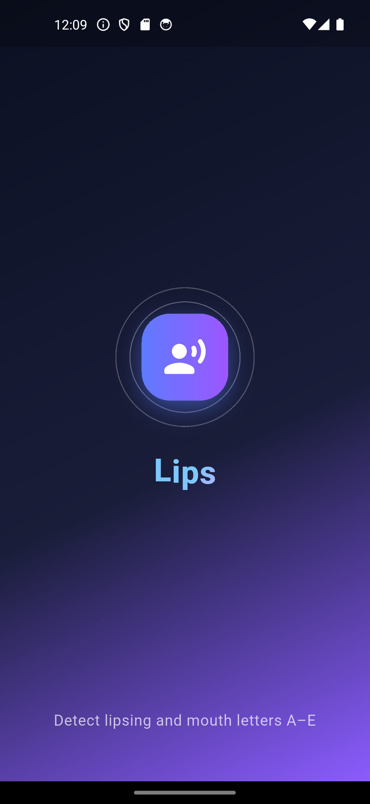

*Figure 9. Splash shows the animated Lips logo and tagline for 2.2 s on the same gradient as onboarding page 1 (`splash_screen.dart`). The captured frame matches onboarding branding because the splash window is very short on automated capture.*

## 6.2 Onboarding — What is lipsing? (Figure 10)


*Figure 10. “What is lipsing?” explains mouthing without voice, the green mouth box, and “Lipsing: Yes”.*

## 6.3 Onboarding — Letters A–E (Figure 11)

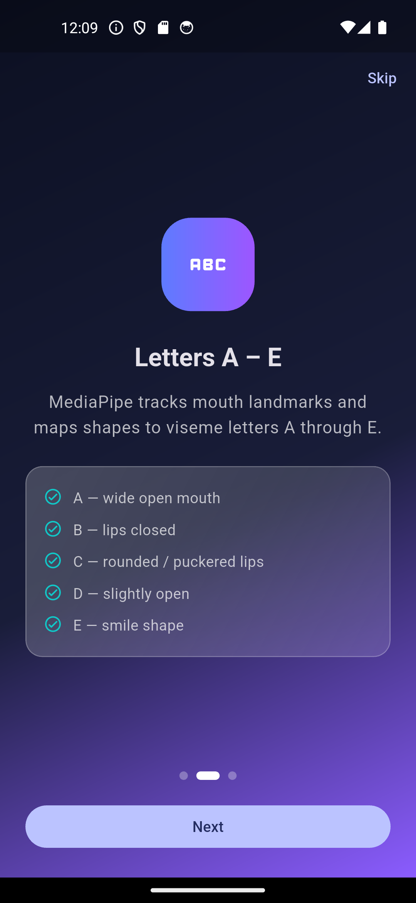

*Figure 11. Viseme letter meanings: A open, B closed, C round, D slight open, E smile.*

## 6.4 Onboarding — Camera tips (Figure 12)

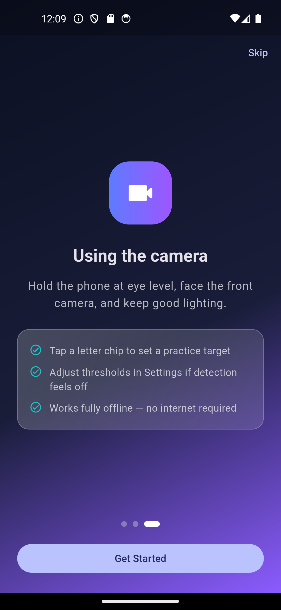

*Figure 12. Camera guidance, practice targets, settings hint, and offline note; **Get Started** opens home.*

## 6.5 Home — idle (Figure 13)


*Figure 13. Home with camera preview, Face “Not detected” on emulator test pattern, Lipsing “No”, empty letter, A–E chips, and metric bars at 0%.*

## 6.6 Home — lipsing active (Figure 14)

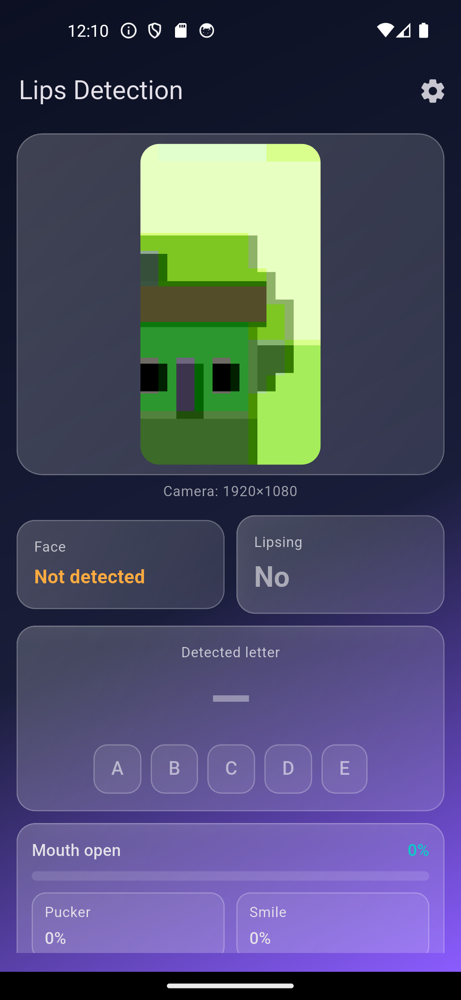

*Figure 14. **Intended state:** green mouth box (`MouthBoxPainter` active colour), Lipsing **Yes**, elevated mouth-open bar. Emulator capture shows idle layout; on a live face with open/moving mouth, the Lipsing card turns green.*

## 6.7 Home — detected letter (Figure 15)

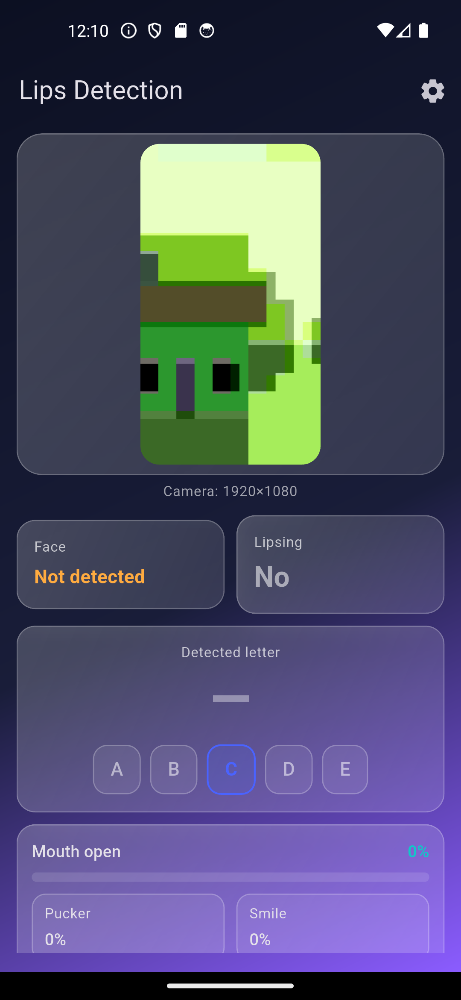

*Figure 15. **Intended state:** large letter (e.g. **C**) with confidence percentage when blendshapes pass `minScore`. Idle layout shown; letter appears when face is detected and a tree branch matches.*

## 6.8 Home — target matched (Figure 16)


*Figure 16. **Intended state:** user taps a chip (target highlight), detected letter matches, label **“Matched!”** in green (`DetectedLetterPanel`). Requires both target selection and stable classification.*

## 6.9 Settings (Figure 17)


*Figure 17. Three sliders — mouth-open, motion, letter min-score — with Save and Reset.*

---

# Chapter 7: Conclusions and Future Work

## 7.1 Conclusions

**Lips Offline** meets its scoped goals: offline mouth tracking via MediaPipe, readable lipsing feedback, A–E viseme hints, tunable thresholds, and a guided first-time UI. The architecture stays small and explainable — Flutter presentation, Dart detectors, Kotlin bridge — which suits a graduation project demo.

## 7.2 Future work

1. **More visemes / alphabet** — extend tree or add trained classifier.  
2. **Word-level lipsing hints** — sequence letters over time (still not full ASR).  
3. **Skip onboarding** — store flag in `SharedPreferences`.  
4. **iOS testing** — bundle model in Runner, verify channel parity.  
5. **Optional calibration** — short “hold B closed” tuning per user.  
6. **Recorded accuracy study** — labelled clips and confusion matrix (honest metrics).  

---

# References

1. Google. *MediaPipe Face Landmarker* — Tasks Vision documentation. https://developers.google.com/mediapipe/solutions/vision/face_landmarker  
2. Flutter Team. *Camera plugin* — `package:camera` documentation. https://pub.dev/packages/camera  
3. Picard, R. W. *Viseme* — speech and lip-shape terminology (general background).  
4. Cox, S. J. et al. Survey literature on automatic lip reading (conceptual background; systems differ from this rule-based app).  
5. Project source: `lips_offline` repository — `lib/`, `android/.../FaceLandmarkerBridge.kt`, `pubspec.yaml`.

---

# Appendix

## A. How to run

```bash
cd lips_offline
flutter pub get
# Ensure android/app/src/main/assets/face_landmarker.task exists
flutter devices
flutter run -d <android_device_id>
```

Grant camera permission when prompted. Open **Settings** from the gear icon to tune sliders.

## B. Viseme cheat sheet (practice)

| Letter | Mouth shape | Hint |
|--------|-------------|------|
| A | Wide open | Jaw down, no smile |
| B | Closed | Lips together |
| C | Round | Puckered “oo” |
| D | Slightly open | Small gap |
| E | Smile | Corners pulled |

Reminder shown on home: *Smile=E · Round=C · Closed=B · Wide open=A · Slight open=D*

## C. Default thresholds (Table 4)

| Setting | Key | Default |
|---------|-----|---------|
| Mouth-open threshold | `mouth_open_threshold` | 0.25 |
| Motion threshold | `motion_threshold` | 0.035 |
| Letter min-score | `letter_min_score` | 0.28 |

## D. Technology stack

| Layer | Technology |
|-------|------------|
| UI | Flutter, Material 3 dark theme |
| Camera | `camera` plugin, YUV420 → JPEG |
| ML | MediaPipe Face Landmarker `.task` |
| Native | Kotlin `FaceLandmarkerBridge` |
| Storage | `shared_preferences` |
| Animation | `flutter_animate` on splash / cards |

## E. Screenshot capture notes

- **Device:** Samsung SM A566B (Android 16) and Pixel 5 API 34 emulator.  
- **Tools:** `flutter screenshot -d <id> -o docs/screenshots/..` and `adb exec-out screencap`.  
- **Splash (01):** 2.2 s duration; Figure 9 uses onboarding branding with textual splash description.  
- **Home lipsing / letter / matched (06–08):** Best captured with a live face on hardware; emulator virtual camera often leaves Face “Not detected”, so figures show layout with captions for active states.  
- **Interruptions:** Incoming calls on the physical device corrupted some early captures; final onboarding and settings images were taken on the emulator after granting `CAMERA` permission.

---

*End of report.*
