# Project Diagrams

Fifteen UML, software-engineering and architecture diagrams for **Lips Offline**.

Every diagram was generated from the **actual code in this repository** — class names, fields, methods, thresholds and relationships were read out of the source, not invented. If you change the code, regenerate them (see the end of this file).

> **Note on numbering.** The dissertation (`docs/LIPS_OFFLINE_DISSERTATION.md`) has its own **Figures 1–17**. The diagrams here are numbered **Diagram 1–15** so the two sets never clash. Diagrams 3, 10 and 14 overlap in subject with dissertation Figures 3, 6 and 2 but are drawn in more detail.

**Images:** `documentation/diagrams/*.png`
**Editable sources:** `documentation/diagrams/src/*.mmd` (Mermaid)

---

## Index

| # | Diagram | UML type | Why it matters in the discussion |
|---|---------|----------|----------------------------------|
| 1 | Class diagram — core logic | Structural | The single most requested diagram. Shows every real class, field and method |
| 2 | Class diagram — presentation | Structural | Shows the widget tree and Flutter inheritance |
| 3 | Package diagram | Structural | Proves the layers only depend downward |
| 4 | Component diagram | Structural | Shows the Dart ↔ native split |
| 5 | Deployment diagram | Structural | Build machine → APK → phone, and the "no network" claim |
| 6 | State machine — LipsingDetector | Behavioural | **Hysteresis made visual.** Very strong answer |
| 7 | State machine — HomeScreen | Behavioural | The loading / error / running states |
| 8 | Activity diagram — one frame | Behavioural | The whole pipeline with its decision points |
| 9 | Activity diagram — letter classification | Behavioural | The E→C→B→A→D priority tree as a flow |
| 10 | Sequence diagram — start-up | Behavioural | Who calls whom, and the threading note |
| 11 | Sequence diagram — settings | Behavioural | Save, reload, and why detectors are rebuilt |
| 12 | Data-flow diagram — Level 0 | Software engineering | The classic context diagram |
| 13 | Data-flow diagram — Level 1 | Software engineering | The seven processes |
| 14 | Use-case diagram | Behavioural | Actors and what each can do |
| 15 | Data storage structure | Software engineering | Why there is **no ERD** |

---

## Diagram 1 — Class diagram: core logic

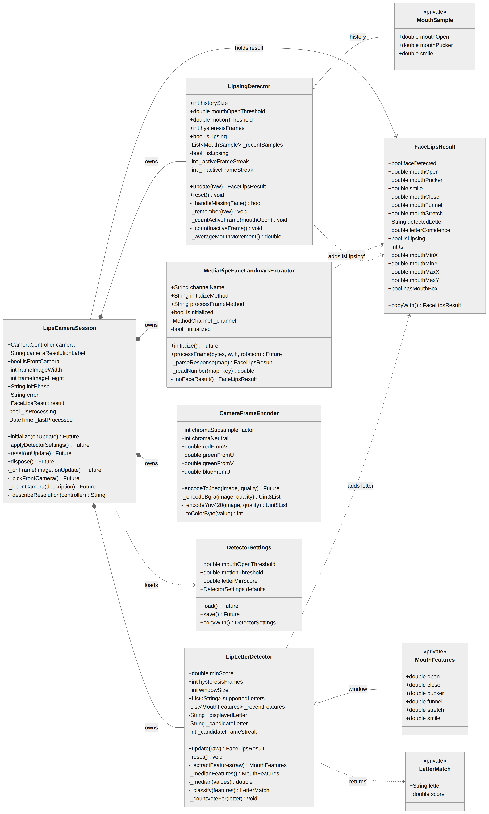

**Shows:** every class in `domain/`, `application/`, `infrastructure/` and `core/` with its real fields and methods, plus the relationships between them.

**Read it like this:**
- `LipsCameraSession` sits in the middle and **owns** (filled diamond = composition) the two detectors, the encoder and the extractor. If the session is destroyed, they go with it.
- `LipsingDetector` **aggregates** `_MouthSample` (hollow diamond) — a history list whose items outlive individual method calls.
- The dotted arrows are **dependencies**: three classes each *create or modify* a `FaceLipsResult` without storing one permanently.
- `+` is public, `-` is private. In Dart, a leading underscore means private.

**Say this to the examiner:**
> "`FaceLipsResult` is the object every stage passes along. `LipsCameraSession` owns the pipeline pieces by composition. The three classes with dotted arrows each add something to the result — the extractor creates it, the lipsing detector adds `isLipsing`, the letter detector adds the letter and confidence."

**Likely questions**
- *Why composition and not inheritance?* Because a camera session **has** detectors; it is not a **kind of** detector. Inheritance would be wrong here.
- *Why are `_MouthSample`, `_MouthFeatures` and `_LetterMatch` private?* They are implementation details of one class each. Nothing outside needs them, so keeping them private stops the API growing.

---

## Diagram 2 — Class diagram: presentation layer

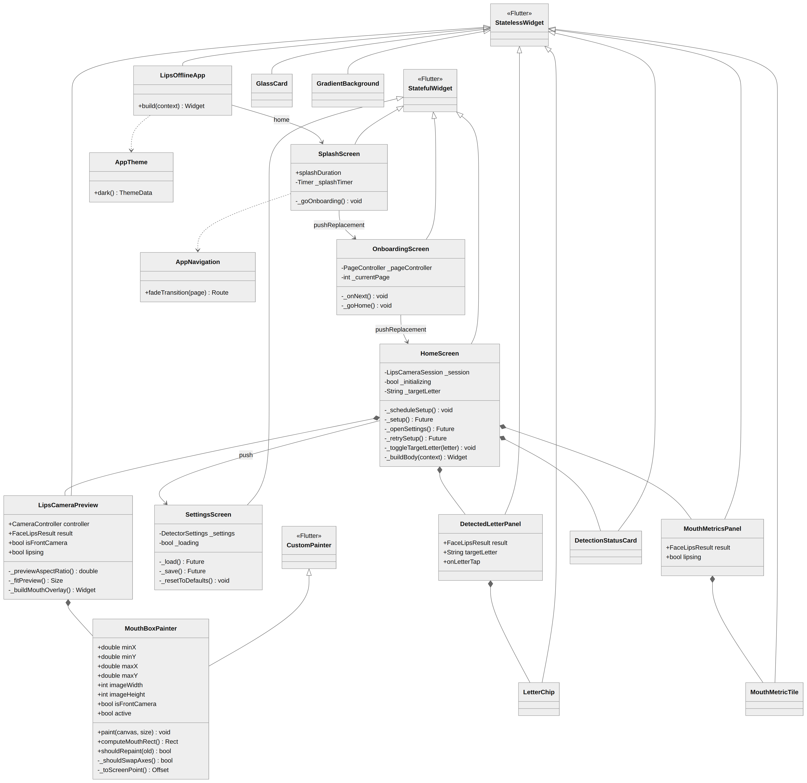

**Shows:** every screen and widget, which Flutter base class it extends, and how screens navigate to each other.

**Read it like this:**
- Hollow triangle arrows = **inheritance**. Everything extends `StatelessWidget`, `StatefulWidget` or `CustomPainter`.
- `HomeScreen` is the only screen that owns detection — it holds a `LipsCameraSession`.
- `MouthBoxPainter` extends `CustomPainter`, which is how Flutter lets you draw directly onto a canvas.

**Say this:**
> "Screens that never change are `StatelessWidget`. Screens whose data changes over time are `StatefulWidget` — `HomeScreen` because the detection result updates several times a second, and `SettingsScreen` because the sliders move."

**Likely questions**
- *Why is `GlassCard` stateless?* It just draws a frosted panel around whatever child it is given. Nothing about it changes on its own.
- *What is `CustomPainter` for?* It gives direct access to a drawing canvas. I needed it because the mouth box is not a normal widget — it is a rectangle drawn at a computed position on top of the camera preview.

---

## Diagram 3 — Package diagram

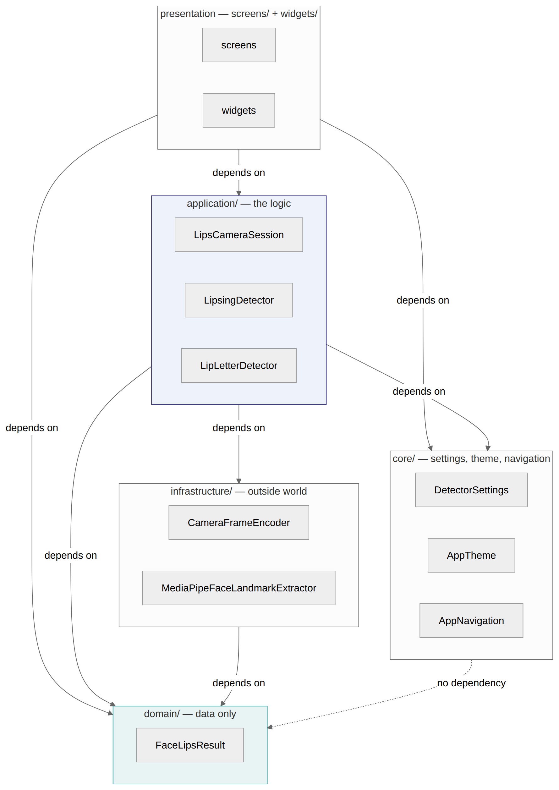

**Shows:** the five folders in `lib/` and the direction of dependency between them.

**The rule:** arrows only ever point **downward**. `domain/` depends on nothing at all.

**Say this:**
> "This is a layered architecture. The important property is that the arrows never point back up — the detection logic in `application/` knows nothing about widgets or the camera. That is exactly why I can unit-test it with fake frames on a laptop with no phone attached, which is how all 73 tests run."

**Likely questions**
- *Is this over-engineering for a small app?* It earns its place for one concrete reason: testability. Without the split, none of the detectors could be tested without a device.
- *What would break the design?* If `domain/` imported anything from `screens/`, the layering would be violated and the data model would stop being independently testable.

---

## Diagram 4 — Component diagram

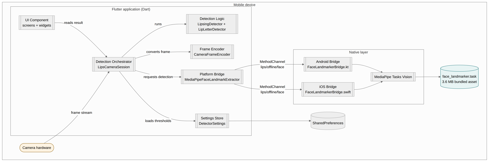

**Shows:** the runtime components inside the phone and the interfaces between them.

**The key boundary** is the `MethodChannel` named `lips/offline/face`. Above it is Dart; below it is Kotlin (Android) or Swift (iOS).

**Say this:**
> "MediaPipe is a native library — there is no Dart version — so the model has to run natively. Flutter's method channel is the standard bridge: Dart sends a method name plus the JPEG bytes, and native code replies with a map of numbers. The channel name appears in three files and must match exactly, or the message is never delivered."

---

## Diagram 5 — Deployment diagram

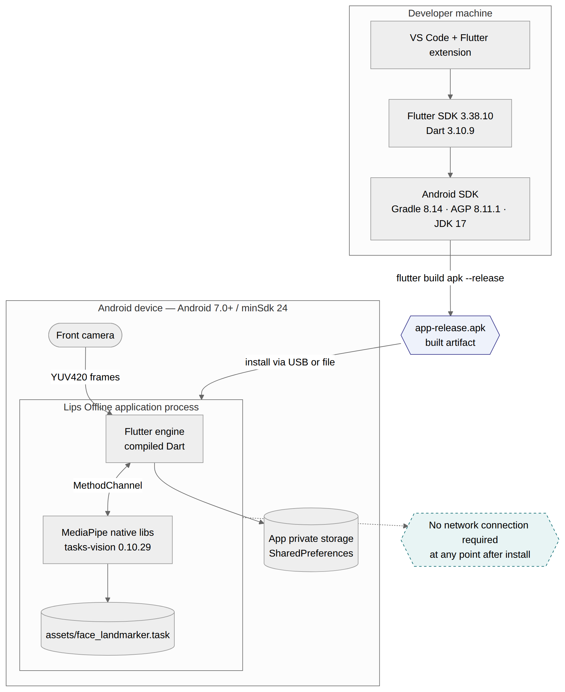

**Shows:** the physical picture — development machine, the built APK, and what ends up running on the phone.

**Note the dashed "no network" box.** Everything needed at runtime — including the 3.6 MB `face_landmarker.task` model — is inside the installed application.

**Say this:**
> "The model file travels inside the APK as an Android asset. After installation the app never needs a network connection, which is both a privacy decision — camera video of a face is sensitive — and a practical one, so a learner can practise anywhere."

---

## Diagram 6 — State machine: LipsingDetector ⭐

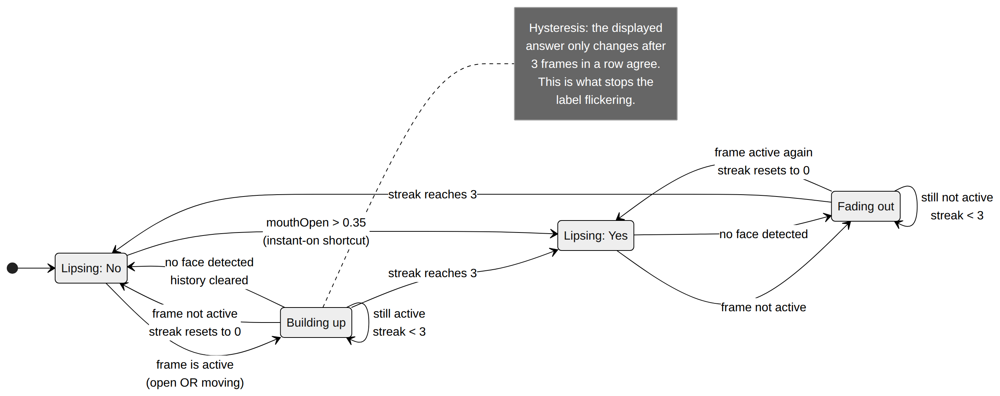

**Shows:** hysteresis as an actual state machine. This is the strongest diagram in the set for explaining *why* the app does not flicker.

**Read it like this:**
- The two states the **user sees** are `Lipsing: No` and `Lipsing: Yes`.
- `Building up` and `Fading out` are the **waiting** states. A streak counter has started but has not reached 3 yet.
- Any disagreeing frame sends you back and **resets the streak to zero**.
- The one shortcut: `mouthOpen > 0.35` jumps straight to Yes, because the answer is obvious and waiting would feel slow.

**Say this:**
> "Hysteresis means requiring several agreeing readings before changing state. Without it, a value sitting exactly on the threshold would make the label flash Yes and No several times a second. Here the answer only changes after three frames in a row agree — and a single disagreeing frame resets the counter."

**Likely questions**
- *What if `hysteresisFrames` were 1?* You would lose the waiting states entirely and the label would flicker.
- *Why does losing the face not jump straight to No?* Because a single dropped frame is normal. It takes three missing frames to fade out, so one glitch does not blank the screen.

---

## Diagram 7 — State machine: HomeScreen

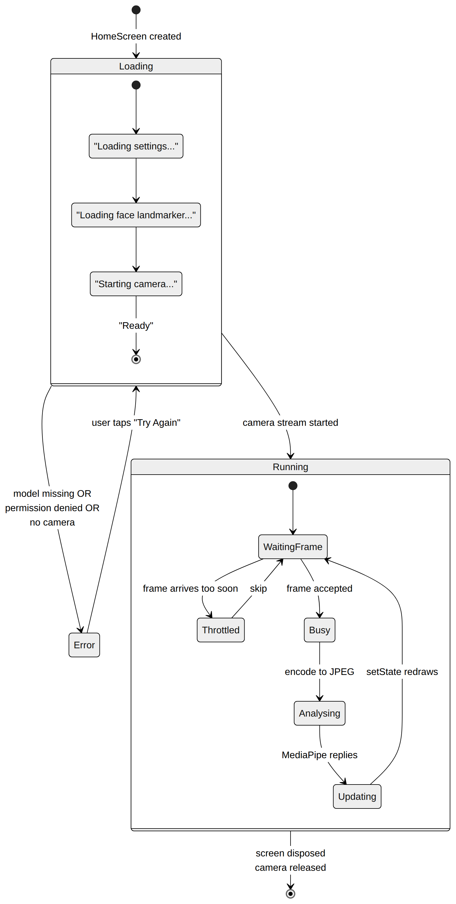

**Shows:** the three top-level states of the main screen, with the start-up sub-states and the per-frame loop nested inside.

**Say this:**
> "The screen is always in exactly one of three states. Loading shows the spinner with the current phase text, so if start-up ever stops the user can see where. Error shows a readable message with a Try Again button that re-enters Loading. Running is the per-frame loop."

---

## Diagram 8 — Activity diagram: processing one frame

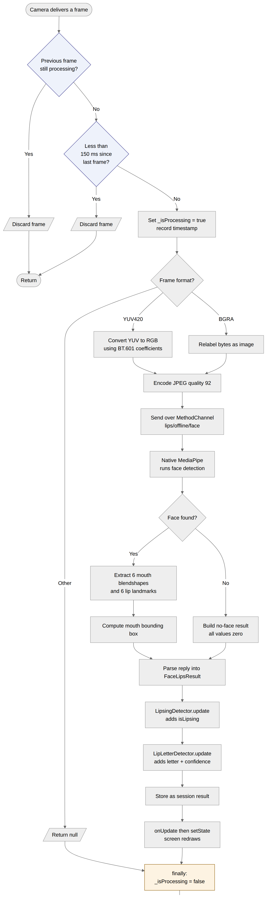

**Shows:** the complete journey of one camera frame, including both guards and every decision point.

**The two diamonds at the top are the guards.** Most frames never get past them — the camera produces about 30 frames a second and MediaPipe can analyse about 7.

**Note the highlighted `finally` box** at the bottom. It always runs, even if something above throws.

**Say this:**
> "Two guards protect the pipeline: one stops a second frame starting while one is still being analysed, the other enforces a 150 millisecond gap to save battery. The `finally` block is essential — if analysis throws an error, the processing flag must still be cleared, otherwise it would stay true forever and detection would stop permanently and silently."

---

## Diagram 9 — Activity diagram: letter classification

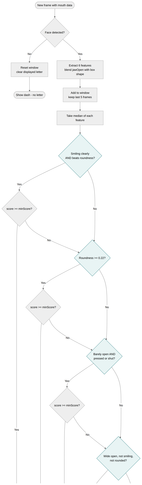

**Shows:** the E → C → B → A → D priority tree drawn as a flow, including the **score check on every branch**.

**The subtle part:** a rule can match on *shape* but still be rejected because its confidence is below `minScore`. When that happens the flow **falls through to the next rule** — it does not give up.

**Say this:**
> "The order matters because real mouth shapes overlap. A smile is also slightly open, so if I asked about D — slightly open — first, every smile would be reported as D. The most distinctive shapes are asked first and the vaguest is left last as a fallback."

---

## Diagram 10 — Sequence diagram: application start-up

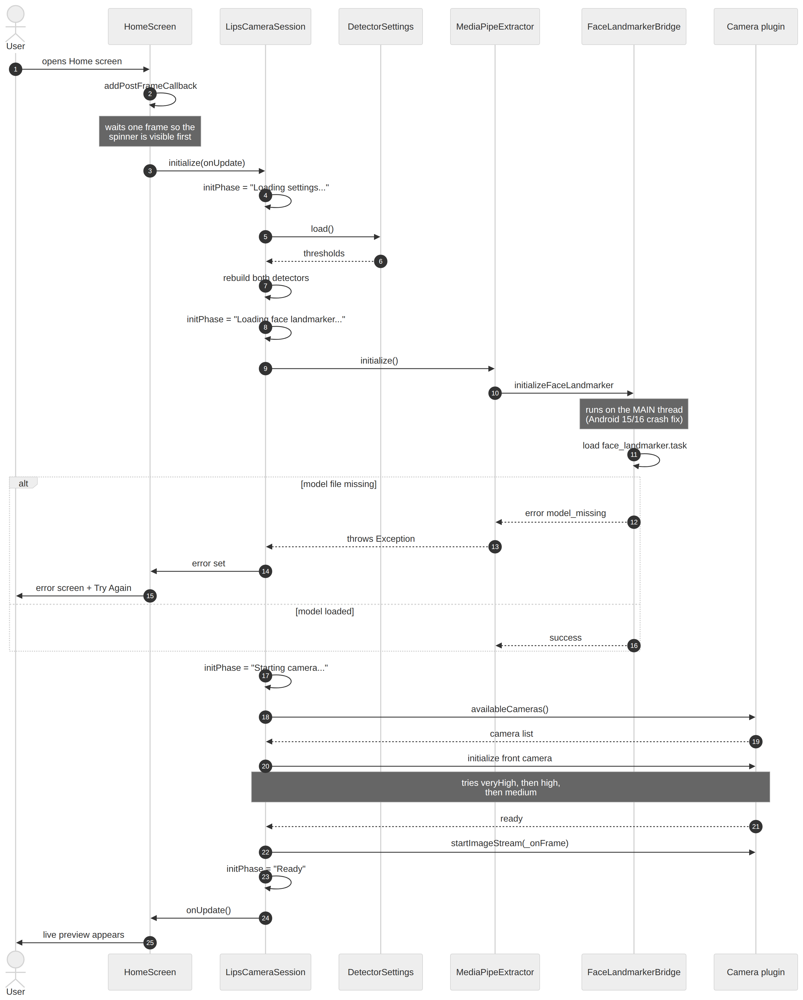

**Shows:** the exact order of calls from the user opening the home screen to the live preview appearing, including the error path when the model file is missing.

**Two notes worth pointing at:**
- The screen waits one frame before starting the camera, so the spinner is visible immediately instead of a blank screen.
- The model is loaded on the **main thread** — a deliberate workaround for crashes on Android 15/16.

---

## Diagram 11 — Sequence diagram: changing settings

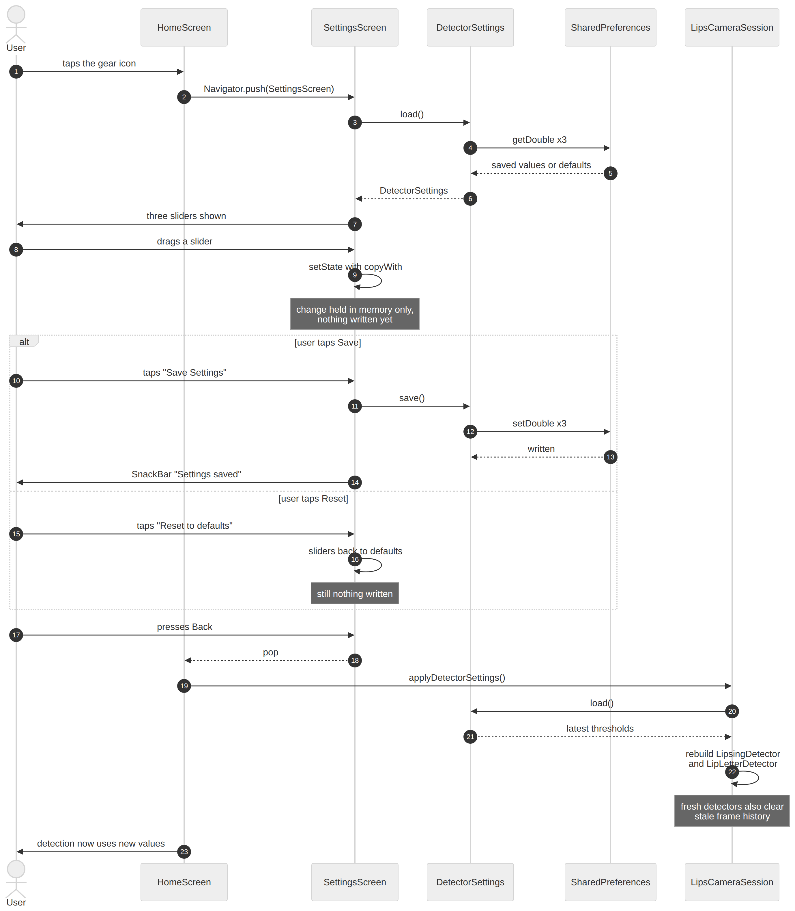

**Shows:** the full settings workflow, including the `alt` fragment for Save versus Reset.

**The important detail:** dragging a slider changes **memory only**. Nothing is written until Save. And going Back triggers `applyDetectorSettings()`, which **rebuilds both detectors**.

**Say this:**
> "The detectors are recreated rather than edited, because their thresholds are `final`. Recreating them also clears the stale frame history — which is correct, because that history was judged against the old thresholds."

---

## Diagram 12 — Data-flow diagram, Level 0 (context)

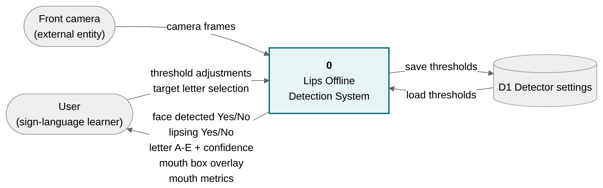

**Shows:** the whole system as one process, with its two external entities and one data store.

Useful when an examiner asks "what are the inputs and outputs of your system?" — the answer is on this one page.

---

## Diagram 13 — Data-flow diagram, Level 1

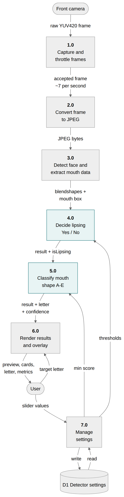

**Shows:** the system decomposed into seven numbered processes, with the data that flows between them.

Maps directly onto the code: process 1.0 is `LipsCameraSession._onFrame`, 2.0 is `CameraFrameEncoder`, 3.0 is the native bridge, 4.0 is `LipsingDetector`, 5.0 is `LipLetterDetector`, 6.0 is `HomeScreen` with its widgets, 7.0 is `DetectorSettings`.

---

## Diagram 14 — Use-case diagram

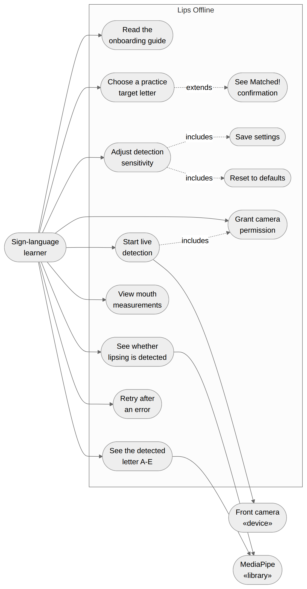

**Shows:** one human actor and two supporting actors, with twelve use cases.

Note the `«extends»` and `«includes»` relationships: seeing "Matched!" **extends** choosing a target letter (it only happens if you chose one), while Save and Reset are **included** in adjusting sensitivity.

---

## Diagram 15 — Data storage structure

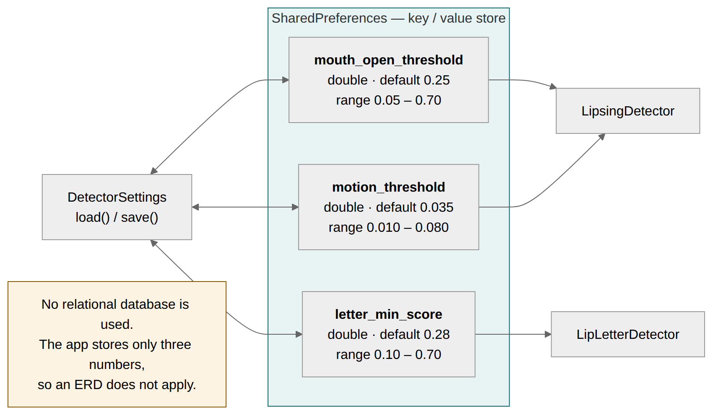

**Shows:** everything the app persists — three numbers in a key-value store.

**There is deliberately no ERD.** Say this plainly if asked:

> "The app has no relational database. It stores exactly three doubles in `SharedPreferences`, which is a key-value store, so an entity-relationship diagram would not apply — there are no entities and no relationships to draw. This diagram shows the real storage structure instead: the three keys, their types, their defaults and their valid ranges."

That is a much better answer than drawing an ERD that does not correspond to anything in the code.

---

## Which diagrams to study first

| Priority | Diagrams |
|----------|----------|
| **Study deeply** | 1 (class core), 6 (hysteresis state machine), 8 (one frame), 9 (letter tree) |
| **Know what they show** | 3 (package), 4 (component), 10 and 11 (sequences), 13 (DFD-1) |
| **Recognise** | 2, 5, 7, 12, 14, 15 |

---

## Regenerating the diagrams

The sources are Mermaid text files in `documentation/diagrams/src/`. Edit any `.mmd` file and re-render it.

**Easiest way** — paste the file contents into the Mermaid live editor at `mermaid.live` and export a PNG.

**Or in VS Code** — install the *Markdown Preview Mermaid Support* extension, put the code in a fenced ```mermaid block, and preview it.

Both Mermaid diagram sources and the rendered PNGs are committed, so you never have to regenerate them just to read them.

---

## Diagram summary for the report

If you need a single table for your dissertation appendix:

| Diagram | Type | File |
|---------|------|------|
| Class — core logic | UML class | `diagrams/01_class_core.png` |
| Class — presentation | UML class | `diagrams/02_class_presentation.png` |
| Package | UML package | `diagrams/03_package.png` |
| Component | UML component | `diagrams/04_component.png` |
| Deployment | UML deployment | `diagrams/05_deployment.png` |
| State — LipsingDetector | UML state machine | `diagrams/06_state_lipsing.png` |
| State — HomeScreen | UML state machine | `diagrams/07_state_home.png` |
| Activity — one frame | UML activity | `diagrams/08_activity_frame.png` |
| Activity — letters | UML activity | `diagrams/09_activity_letter.png` |
| Sequence — start-up | UML sequence | `diagrams/10_sequence_startup.png` |
| Sequence — settings | UML sequence | `diagrams/11_sequence_settings.png` |
| DFD Level 0 | Structured analysis | `diagrams/12_dfd0.png` |
| DFD Level 1 | Structured analysis | `diagrams/13_dfd1.png` |
| Use case | UML use case | `diagrams/14_usecase.png` |
| Data storage | Structured analysis | `diagrams/15_storage.png` |
